# FujiNet Owner's Manual for the Atari 2600

*How to set up and use the FujiNet network cartridge on an Atari 2600 Video Computer System: the cartridge, joining your WiFi with a joystick, loading games from the Internet, a memory card or your own file server, the Game Lobby, the FujiNet network games, and the classics that are learning to play over the Internet.*

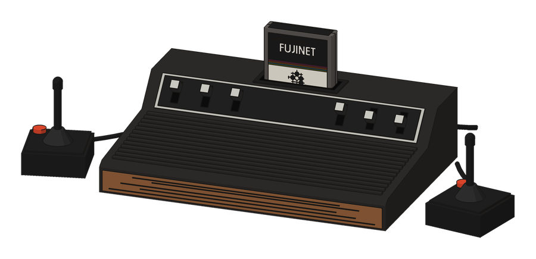

---

## Contents

1. [Unpack Cartridge](#1-unpack-cartridge)
2. [Know Your Cartridge](#2-know-your-cartridge)
3. [How It Works](#3-how-it-works)
4. [Insert Cartridge](#4-insert-cartridge)
5. [To Start Play](#5-to-start-play)
6. [Join Your Network](#6-join-your-network)
7. [Hosts and the Browser](#7-hosts-and-the-browser)
8. [Loading Games](#8-loading-games)
9. [Copying Games](#9-copying-games)
10. [Info and the Web Control Panel](#10-info-and-the-web-control-panel)
11. [The Game Lobby](#11-the-game-lobby)
12. [5 Card Stud](#12-5-card-stud)
13. [Texas Hold'em](#13-texas-holdem)
14. [Battleship](#14-battleship)
15. [Fujitzee](#15-fujitzee)
16. [M.U.L.E.](#16-mule)
17. [Classics, Networked](#17-classics-networked)
18. [Maintenance](#18-maintenance)
19. [Trouble Shooting Checklist](#19-trouble-shooting-checklist)
20. [Parts List](#20-parts-list)
21. [Quick Reference](#quick-reference)

### In a Hurry?

1. With the console **OFF**, push the FujiNet cartridge into the slot, label toward you. Plug a joystick into **LEFT CONTROLLER**.
2. Slide the **POWER** switch **ON**. The FujiNet menu appears.
3. Pick your WiFi network with the joystick and press the red button ("fire"). Spell the password on the on-screen keyboard ([Section 6](#6-join-your-network)).
4. On the **FN HOSTS** screen, move to **apps.irata.online** and press fire. Open **Atari_2600**.
5. Move to a game and press fire. It loads and starts by itself.
6. To come back to the FujiNet menu, press the **RESET button on the cartridge** (not the console's GAME RESET switch).

---

## 1. Unpack Cartridge

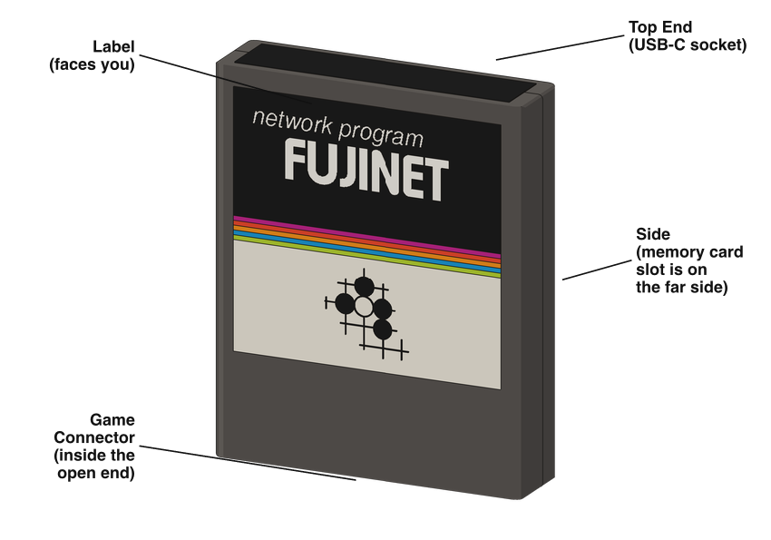

When you take your **FujiNet Network Cartridge** from its box, you should have the FujiNet cartridge and this Owner's Manual.

The FujiNet cartridge goes in your console's Game Program slot like any other cartridge. Inside it is a complete network adapter: a WiFi radio, a memory-card reader and two small computers. It lets your Atari play games that are kept on the Internet, on a memory card, or on a computer in your home — and play some of them against people far away.

### What You Also Need

- **An Atari 2600** of any model — the original six-switch console, the four-switch model, or the 2600 Jr. An Atari 7800, which plays 2600 cartridges, works too. FujiNet is made for **NTSC** (North American) consoles and televisions.
- **A joystick**, plugged into **LEFT CONTROLLER**. FujiNet's menus are worked with the joystick and its red button.
- **Your WiFi network's name and password.** FujiNet uses the 2.4 GHz band, which nearly every home router offers.

You may also want a **microSD memory card** (formatted FAT32) to keep games on, and a **USB-C phone charger** for extra power ([Section 4](#4-insert-cartridge)).

> **NOTE:** FujiNet makes no changes to your console. Take the cartridge out and your Atari is exactly as it was.

## 2. Know Your Cartridge

The cartridge has two faces. The **label** faces you, toward the front of the console. The **back** faces the back of the console, and carries everything you can press or see light up.

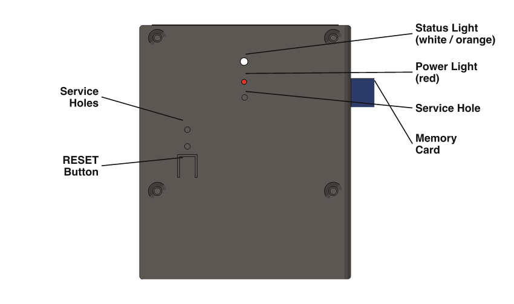

### The Lights

| Light | What it means |
|---|---|
| **White**, steady | FujiNet is connected to your WiFi network. |
| **Orange**, flickering | FujiNet is busy: reading the network or the memory card, or sending a game to the console. It goes back to white when it is done. |
| Status light **off** | FujiNet is not connected to WiFi (yet). |
| **Red** | The cartridge has power and is running. |

The lights face the back of the console. Lean over the top of the console to see them.

### The RESET Button

The **RESET** button on the back of the cartridge restarts the cartridge and brings back the FujiNet menu, whatever game is running. It is the way home. It is not the same as the console's **GAME RESET** switch, which belongs to the game you are playing.

> **IMPORTANT:** The three small **service holes** are for loading new firmware into the cartridge. Do not push anything into them in everyday use.

### The Top End and the Side

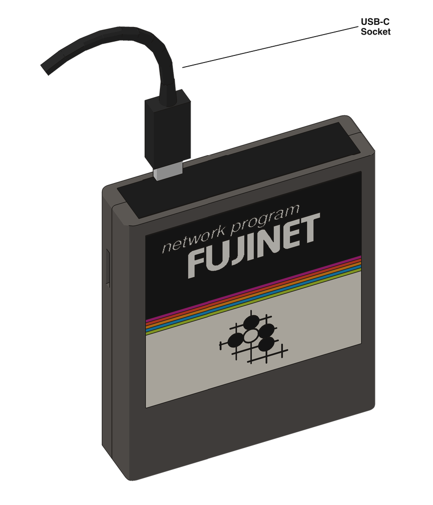 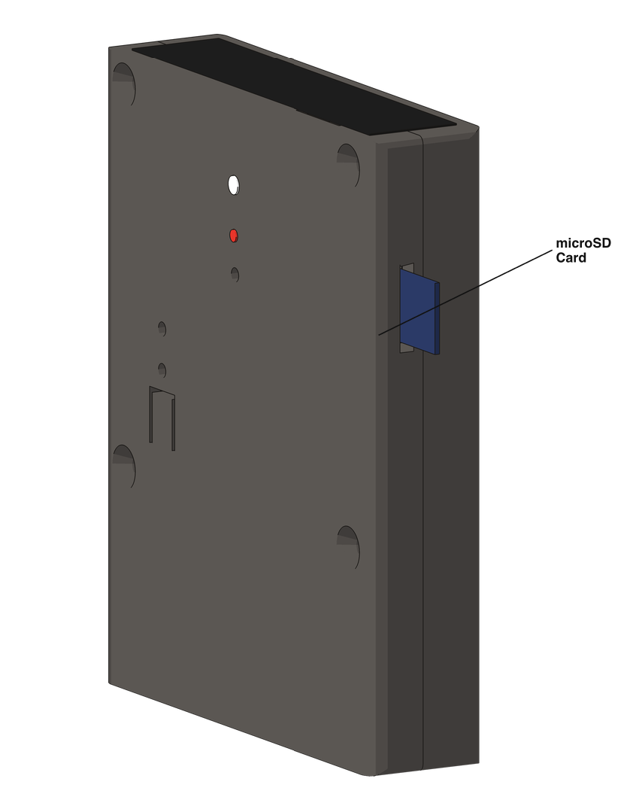

**USB-C socket (top end).** The cartridge normally runs on power from the console. A USB-C phone charger plugged in here powers it too. Power from the charger never flows back into the console, so it is safe to leave it plugged in. The same socket is used to load new firmware.

**Memory card slot (side).** A microSD card pushes into the slot in the side of the cartridge — the left end as you sit at the console — with its printed side toward the back of the cartridge, contacts first. Push it in until it clicks; push again to let it out.

### A Look Inside

You never need to open the cartridge, but this is what is inside. The board faces the back of the console.

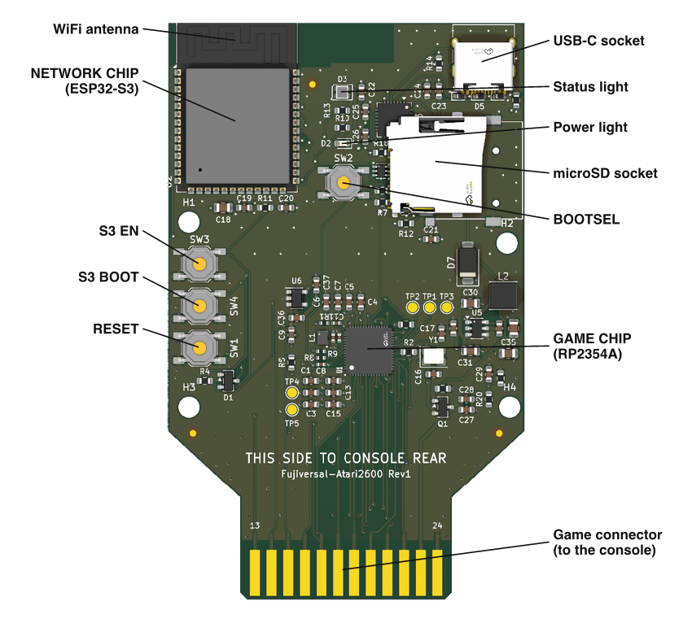

## 3. How It Works

Your 2600 was built in 1977 to play cartridges. It has no network port, no keyboard, no letters of its own, and only **128 bytes** of memory — fewer than the letters in this paragraph. A FujiNet cartridge puts it on the Internet anyway. Here is the trick, in pictures.

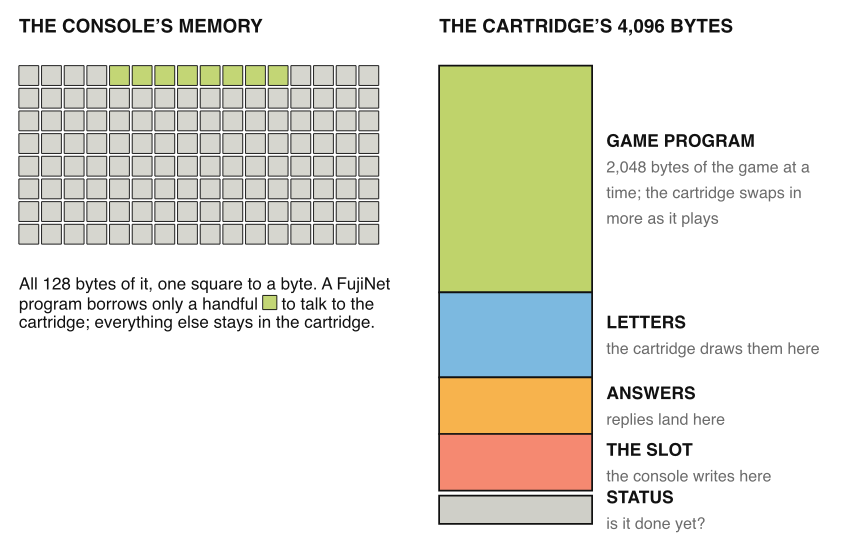

The console cannot hold a web page, a list of games or even a long name. So FujiNet keeps all of that in the **cartridge**, in the 4,096 bytes of address space every cartridge has, and lets the console look at it. Most of that space is the game itself. The rest is FujiNet's: a **slot** the console writes questions into, a **window** where the answers appear, and pages of **letters** the cartridge draws for it.

| | The console, 1977 | The cartridge, 2026 |
|---|---|---|
| **Computers** | one 6507, about 1.2 million steps a second | two (the game chip and the network chip), each a hundred times faster |
| **Memory** | 128 bytes | over a million bytes, and 8 million more beside |
| **Storage** | the 4,096 bytes a cartridge shows it | 18 million bytes of its own, and the memory card |
| **Network** | none | WiFi, and through it the whole Internet |

### How a Question Gets Answered

**1. Ask.** The game writes its question into *the slot*, one byte at a time. A cartridge is only meant to be read — the connector does not even have a wire that says "write". But FujiNet's game chip watches every address and every byte that crosses the connector, and it catches the question as it goes by.


**2. Pass it on.** The game chip hands the question to the network chip beside it.


**3. Fetch.** The network chip does the work a 1977 console never could: it joins your WiFi, reaches the server, or reads the memory card.


**4. Answer.** The answer goes into the cartridge's *window*. To the console it looks as though the answer had been printed in the cartridge all along. It simply reads it.


### Letters, and Whole Games

**The letters.** The 2600 has no letters at all: everything on the screen is drawn a line at a time as the TV's beam sweeps past. FujiNet's cartridge works out the shape of every letter for it, so all the console does is copy them to the screen — which is why every FujiNet screen has the same square lettering, twelve letters across and twenty-one lines down.

**Whole games.** When you load a game, FujiNet sends all of it, up to 32,768 bytes, into the cartridge's own memory. Then the menu steps aside and the cartridge becomes that game's cartridge, page-switching and all.

> The full story — every address, every command, and how to write your own FujiNet programs for the 2600 — is in the [FujiNet Programming Guide for the Atari 2600](FujiNet-Programming-Guide-for-the-Atari-2600) (the *Programmer's Handbook*, sections 3 to 6) and in *FujiNet for the Atari 2600: Theory of Operation*.

## 4. Insert Cartridge

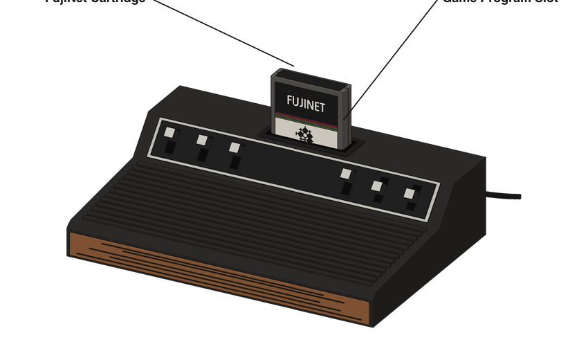

- Check that the **POWER** switch on the console is **OFF**.

> **IMPORTANT:** To protect your console and the cartridge, the console should be OFF whenever you put a cartridge in or take one out.

- Hold the FujiNet cartridge so its label faces you and reads right side up.
- Push it **carefully** into the slot until it is firmly seated. Do **not** force it.

When you take the cartridge out, pull it straight up, and check first that the POWER switch is OFF.

### Plug in a Joystick

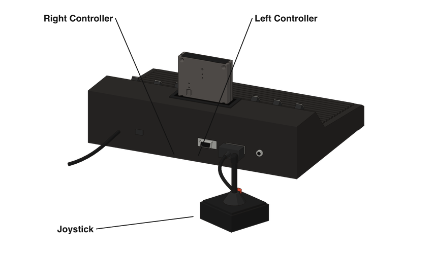

Plug a joystick into the **LEFT CONTROLLER** jack on the back of the console. The FujiNet menu and every FujiNet game listen to the left joystick.

> **NOTE:** Some games want a second joystick, or paddles. The game will tell you; FujiNet does not mind what is plugged in.

### Extra Power

The cartridge runs on power from the console. If your console is a 2600 Jr or a 7800, or if the picture jumps or the FujiNet menu starts over by itself when the WiFi connects, plug a **USB-C phone charger** into the top of the cartridge. It never sends any power back to the console.

## 5. To Start Play

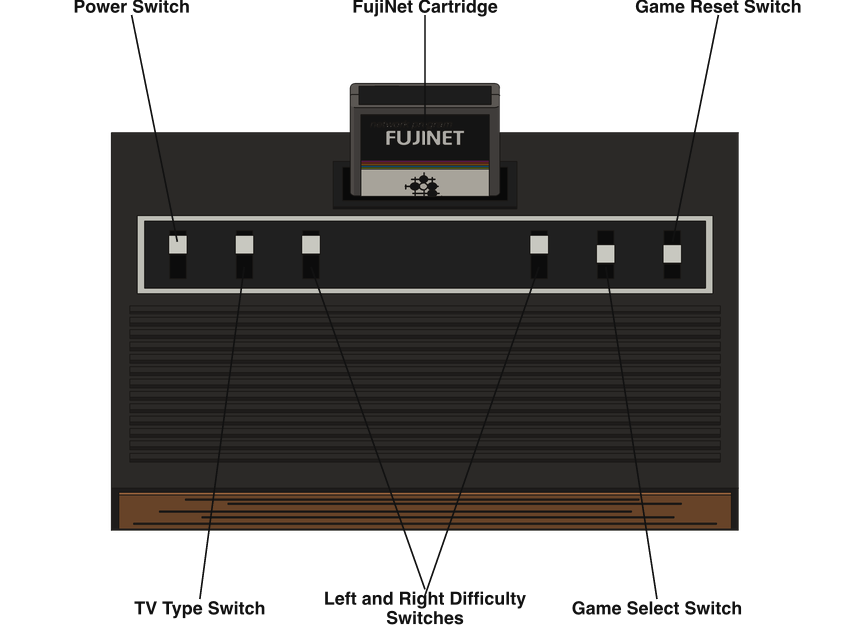

- Turn on your TV, set its volume low, and tune it to **channel 3**, just as for any Atari game.
- If your TV is black and white, slide the **TV TYPE** switch to **B·W**. Otherwise leave it at **COLOR**.
- Slide the **POWER** switch **ON**. The FujiNet menu appears.

The first time you turn it on, FujiNet looks for WiFi networks and asks you to choose yours ([Section 6](#6-join-your-network)). After that it remembers, and goes straight to the list of hosts ([Section 7](#7-hosts-and-the-browser)).

### The Joystick in the FujiNet Menu

| In every FujiNet menu | |
|---|---|
| **>** | The arrow at the left marks the line you are on. |
| Joystick up/down | Move up and down the list. |
| Joystick left/right | Turn the page, when a list is longer than the screen. |
| **FIRE** | Choose the line you are on. |
| **GAME SELECT** | Open the **ACTIONS** menu for this screen. GAME SELECT again closes it without choosing. |

The menu does not use the GAME RESET switch, the difficulty switches or the TV TYPE switch. The game you load decides what those do.

> **NOTE:** The **RESET button on the cartridge** is not the console's GAME RESET switch. GAME RESET belongs to the game. The cartridge's RESET always brings you back to the FujiNet menu.

Hold the joystick with the red button at the top left, the cord leading toward the TV.

## 6. Join Your Network

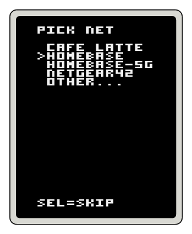

The first time you turn on the console with the FujiNet cartridge in it, FujiNet looks for WiFi networks nearby (the screen may go dark for a few seconds), then lists what it heard.

1. Push the joystick up or down until the **>** is beside the name of your network.
2. Press the red button. The keyboard appears, titled **PASSWORD**.
3. Spell your password (see *The Keyboard*, below).
4. Press **GAME SELECT**, move to **ACCEPT** and press the red button.

Names longer than eleven letters are cut short. If your network is not in the list, choose **OTHER...** at the bottom: FujiNet asks for the network's name (**ENTER SSID**) first, and then for the password.

FujiNet now tries to join. The screen says **CONNECTING** and **PLEASE WAIT**; this can take up to about forty seconds. When it is done, the status light turns white and the list of hosts appears. FujiNet remembers your network.

If the screen says **WIFI FAILED**, the password was not right or the router is too far away. Press **GAME SELECT** to go on without WiFi, then choose **WIFI** from the ACTIONS menu on the hosts screen to try again.

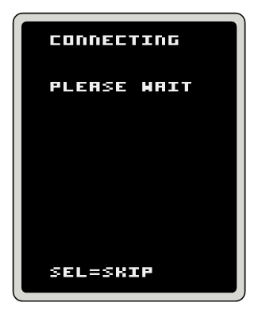 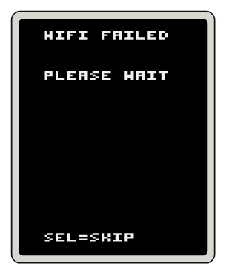

> **NOTE:** You can skip WiFi altogether: press GAME SELECT at **PICK NET**. FujiNet still plays games from its memory card.

### The Keyboard

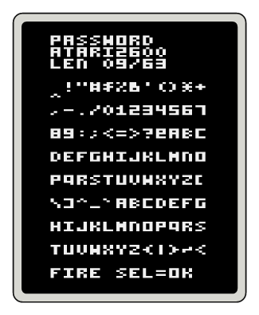

FujiNet has no keyboard to plug in, so it draws one. Move the **^** pointer under a character with the joystick and press the red button to type it. The top line shows what you have typed so far; **LEN** counts the letters. The bottom-right key, **<**, erases the last letter. **GAME SELECT** opens the keyboard's ACTIONS: **ACCEPT** (done), **CANCEL** (leave it as it was), **CLEAR** (start over). A password can be up to 63 letters, a network name up to 32.

> **IMPORTANT:** Passwords care about capitals and small letters. FujiNet's screen draws them all the same way, so use this chart: the **top** letters on the keyboard are CAPITALS and the **bottom three rows** are small letters.

| | | | | | | | | | | | |
|---|---|---|---|---|---|---|---|---|---|---|---|
| *space* | `!` | `"` | `#` | `$` | `%` | `&` | `'` | `(` | `)` | `*` | `+` |
| `,` | `-` | `.` | `/` | `0` | `1` | `2` | `3` | `4` | `5` | `6` | `7` |
| `8` | `9` | `:` | `;` | `<` | `=` | `>` | `?` | `@` | `A` | `B` | `C` |
| `D` | `E` | `F` | `G` | `H` | `I` | `J` | `K` | `L` | `M` | `N` | `O` |
| `P` | `Q` | `R` | `S` | `T` | `U` | `V` | `W` | `X` | `Y` | `Z` | `[` |
| `\` | `]` | `^` | `_` | `` ` `` | **`a`** | **`b`** | **`c`** | **`d`** | **`e`** | **`f`** | **`g`** |
| **`h`** | **`i`** | **`j`** | **`k`** | **`l`** | **`m`** | **`n`** | **`o`** | **`p`** | **`q`** | **`r`** | **`s`** |
| **`t`** | **`u`** | **`v`** | **`w`** | **`x`** | **`y`** | **`z`** | `{` | `\|` | `}` | `~` | *erase* |

## 7. Hosts and the Browser

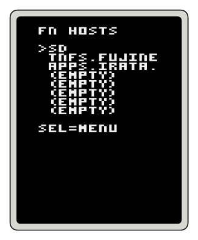

A **host** is a place where games are kept: the memory card in the cartridge, a server on the Internet, or a computer in your home. FujiNet remembers eight of them, and lists them on the **FN HOSTS** screen every time you turn on. A new FujiNet comes with three:

- **SD** — the microSD card in the side of the cartridge.
- **tnfs.fujinet.online** — the FujiNet project's own library.
- **apps.irata.online** — the library that keeps the 2600's network games.

The other five say **(EMPTY)**. Names are cut to eleven letters, so *apps.irata.online* shows as **APPS.IRATA.** Move to a host and press the red button to look inside it.

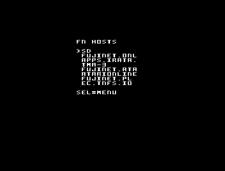

**What your TV shows.** FujiNet's twelve-letter menus sit in a narrow column in the middle of the screen; the screens in this guide show that column close up. (This one has a few more hosts filled in.)

### Adding a Host

1. Move the **>** to an **(EMPTY)** line.
2. Press **GAME SELECT**. Choose **RENAME**.
3. The keyboard appears, titled **HOST NAME**. Spell the server's name or address, for example `192.168.1.20` or `games.local`.
4. Press **GAME SELECT** and choose **ACCEPT**.

A host name can be up to 31 letters. A plain name means a **TNFS** server, the usual kind. FujiNet can also reach other kinds of server if you spell the kind in front:

| Type this | For |
|---|---|
| `SD` | the memory card in the cartridge |
| `games.local` or `192.168.1.20` | a TNFS server — the usual kind |
| `smb://server/share` | a Windows or Samba file share |
| `ftp://server` | an FTP server |
| `http://server/path` | a web server (`https://` too) |

### The Hosts Menu

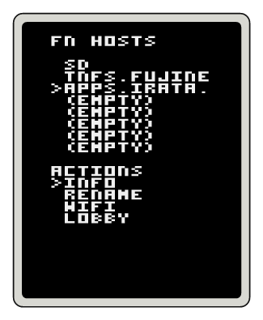

**GAME SELECT** on FN HOSTS opens its ACTIONS: **INFO** (your network and FujiNet's version), **RENAME** (fill in or change the host you are on), **WIFI** (choose a WiFi network again), **LOBBY** (the FujiNet Game Lobby). Up and down choose; the red button does it; GAME SELECT closes the menu.

### The Browser

When you open a host, **FN BROWSE** shows what is in it, fourteen names to a page. The second line shows where you are. Folders end in **/** and come first; games follow, A to Z.

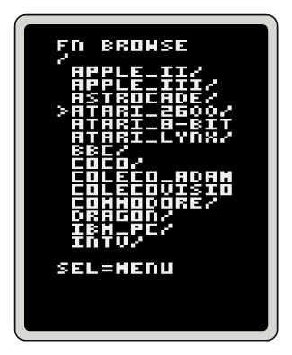 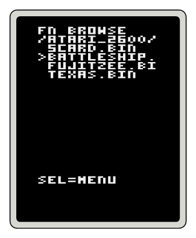 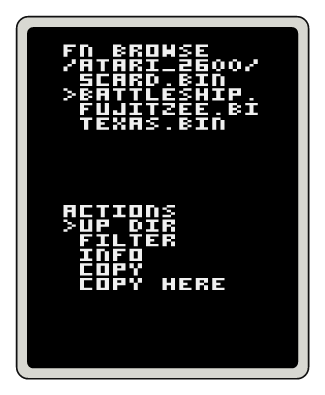

| In the browser | |
|---|---|
| Joystick up/down | Move up and down the page. |
| Joystick right | Next page (when there is more). |
| Joystick left | Previous page. On the first page, go back up one folder; at the top of the host, go back to FN HOSTS. |
| **FIRE** | On a folder, open it. On a game, **load it**. |
| **GAME SELECT** | **UP DIR** · **FILTER** · **INFO** · **COPY** · **COPY HERE** |

**FILTER** shows only the names that match a pattern: `*` stands for any letters and `?` for any one letter, so `B*` shows only games beginning with B, and `*.BIN` only `.BIN` files. Folders are always shown; an empty filter shows everything. Long names are cut to eleven letters; the full name is still what FujiNet loads. The small `.CFG` files some games need are kept out of the list.

## 8. Loading Games

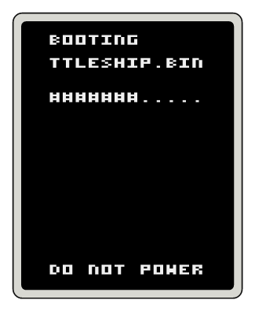 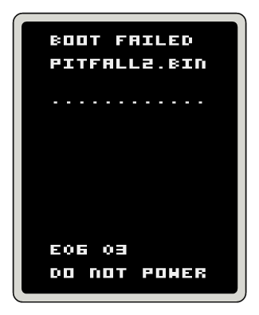

To load a game, find it in the browser and press the red button. **BOOTING** shows the end of the game's name and a bar that fills as it loads; **DO NOT POWER** off while it does. Then the game starts just as if its own cartridge were in the slot. If it says **BOOT FAILED**, the game is one FujiNet cannot play, or the file is damaged; after a few seconds you are back in the browser.

> **IMPORTANT:** To leave a game and go back to the FujiNet menu, press the **RESET button on the cartridge**. Turning the console off and on again does the same. The console's GAME RESET switch only restarts the game.

### From the Internet

| Host | Folder | What is there |
|---|---|---|
| **apps.irata.online** | **Atari_2600** | The FujiNet network games: 5 Card Stud, Texas Hold'em, Battleship, Fujitzee |
| **apps.irata.online** | **mule / atari-2600** | M.U.L.E. |
| **tnfs.fujinet.online** | | The FujiNet project's library for every computer and console |

### From the Memory Card

1. On your computer, copy your games onto a microSD card formatted FAT32. You may put them in folders.
2. With the console OFF, push the card into the side of the cartridge until it clicks.
3. Turn on. Open the **SD** host, and choose a game.

### From Your Own File Server

A computer in your home can serve games to FujiNet with a small free program called a **TNFS server** (Windows, Mac, Linux, Raspberry Pi; see [fujinet.online](https://fujinet.online)).

1. Install the TNFS server, and point it at a folder of games.
2. Find your computer's network address — something like `192.168.1.20`.
3. On FN HOSTS, RENAME an (EMPTY) host to that address.
4. Open it. Your folder appears in the browser.

A Windows share (`smb://`) or an FTP or web server works the same way.

### Which Games Will Load

FujiNet loads a game into its own memory and then plays the part of that game's cartridge, page-switching included. Most of the 2600 library loads just by choosing it:

| Game size and kind | For example |
|---|---|
| 2K and 4K games | Combat, Adventure, Pitfall!, Space Invaders |
| 8K (F8) | Asteroids, Ms. Pac-Man, Raiders of the Lost Ark |
| 12K (FA, CBS RAM Plus) | Omega Race, Mountain King, Tunnel Runner |
| 16K (F6) | Solaris, Midnight Magic |
| 32K (F4) | Fatal Run |
| Super Chip games (F8SC, F6SC, F4SC) | Dig Dug, Crystal Castles, Off the Wall — found by themselves |

A few kinds of game cannot be told apart by their size. They load when a small text file sits beside them with the **same name** ending in `.CFG`, holding one word — the kind:

| Word | Kind | For example |
|---|---|---|
| `E0` | Parker Brothers 8K | Frogger II, Montezuma's Revenge, Popeye, Gyruss |
| `FE` | Activision 8K | Decathlon, Robot Tank |
| `UA` | UA Limited 8K | Pleiades, Funky Fish |
| `CV` | CommaVid | Magicard, Video Life |

For example, `MONTEZUMA.BIN` and a file `MONTEZUMA.CFG` containing just `E0`.

**File names.** FujiNet loads files whose names end in **.BIN** or **.ROM**; rename `.A26` files to `.BIN`. Games may be up to 32K.

**Not yet supported:** Pitfall II and other games with an extra chip of their own (DPC), Starpath Supercharger tapes, Tigervision and other games larger than 32K or with their own page-switching (3E, 3F, F0, EF, DF, BF, SB), and the modern ARM-powered homebrews.

> **NOTE:** FujiNet is made for NTSC consoles and TVs. PAL games may roll or lose their colour.

## 9. Copying Games

1. In the browser, move the **>** to the game you want to copy. Press **GAME SELECT** and choose **COPY**.
2. The hosts screen comes back, titled **COPY TO**. Choose the host to copy to — **SD** for the memory card.
3. Find the folder the game should go in. Press **GAME SELECT** and choose **COPY HERE**.

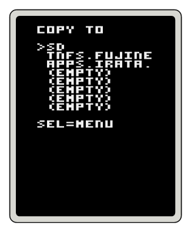 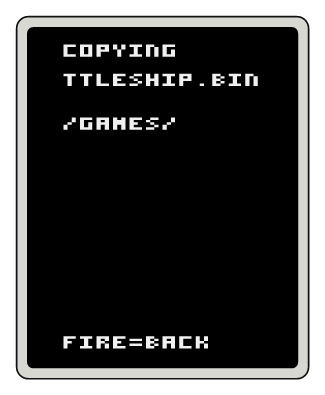 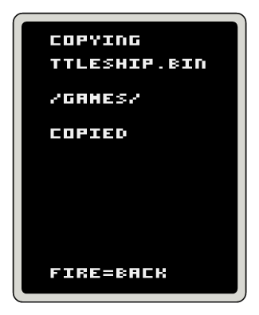

When it says **COPIED**, press the red button (or wait a moment). **COPY FAILED** means the memory card may be full or missing, or the host is read-only (as the Internet libraries are). A game's `.CFG` file is copied along with it.

## 10. Info and the Web Control Panel

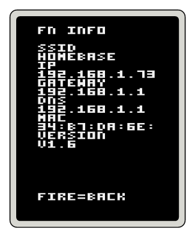

Choose **INFO** from the ACTIONS menu to see how FujiNet is connected: **SSID** (the WiFi network), **IP** (FujiNet's address), **GATEWAY** (your router), **DNS**, **MAC** (FujiNet's hardware number; only the start fits) and **VERSION** (the firmware). Press the red button to go back.

### The Web Control Panel

Type FujiNet's **IP** address from the INFO screen into a web browser on the same network — for example `http://192.168.1.73/`; on many networks `http://fujinet.local/` works too. The control panel lets you change the WiFi network, fill in the eight host slots with a real keyboard, and see the adapter's settings and version.

### Setting WiFi from the Memory Card

Make a plain text file called `fnconfig.ini` in the top folder of the memory card:

```ini
[WiFi]
enabled=1
SSID=YourNetworkName
passphrase=YourPassword
```

FujiNet reads it each time it starts, and writes back to it whatever you change in the menu or the control panel.

## 11. The Game Lobby

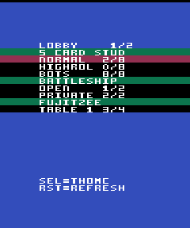

The **FujiNet Game Lobby** lists every network game that has a table open right now, on every kind of computer and console FujiNet works with. Pick a table and the Lobby loads the right game and sends you straight to it. To open it, press **GAME SELECT** on FN HOSTS and choose **LOBBY**.

The top line says **LOBBY** and which page you are on. Each game has a coloured band; under it are its tables, with how many players are sitting and how many seats there are — **2/8** is two players at a table for eight.

| In the Lobby | |
|---|---|
| Joystick up/down | Choose a table. |
| Joystick left/right | Previous or next page. |
| **FIRE** | Join that table: load its game and sit down. |
| **GAME SELECT** | Change your name (**SEL=** shows it). |
| **GAME RESET** | Fetch the list again (**RST=REFRESH**). |

**Your name.** FujiNet keeps one player name for all of its games. On the **ENTER NAME** keyboard the joystick moves, the red button types, GAME SELECT erases and GAME RESET is done; up to eight letters and numbers.

| Screen says | What is happening |
|---|---|
| **LOADING** | Fetching the list of tables. |
| **NO SERVERS** | No game has a table open just now. Load a game from the browser instead — its own table list works without the Lobby. |
| **JOINING**, **MOUNTING** | Getting your game ready. |
| **DO NOT STOP** | Loading the game. Leave the console on. |
| **ERR** and a number | Something on the network did not answer. Press GAME RESET to try again. |

## 12. 5 Card Stud

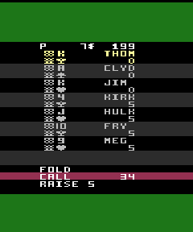

Up to eight players around one table, on any machine FujiNet plays on, with the house's robots filling empty seats. Each hand you get one card face down and four face up; the best poker hand takes the pot.

**Loading.** Choose a 5 Card Stud table in the Lobby, or load **5CARD.BIN** from host **apps.irata.online**, folder **Atari_2600**. Give your name if asked (**YOUR NAME**: the red button types, **OK** finishes, **DEL** erases, **SPC** is a space). *The Basement* and *The Den* are for people; the *AI Rooms* seat you with two, four or six robots. **FIRE TO SIT**.

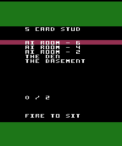 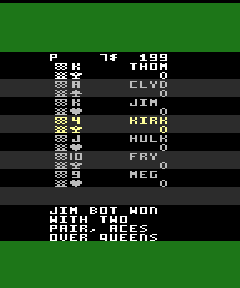 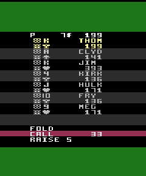 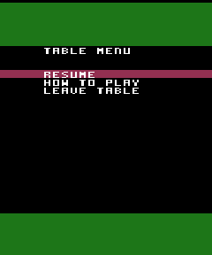

**The table.** Top line: **P** and the pot, then **$** and your purse. Eight seats, two lines each: each card's rank over its suit, then the player's name and bet (a face-down card is a hatched back until the showdown). A seat's colour shows whose turn it is, who has folded or left, and which seat is yours. At the bottom: your moves when it is your turn — the bar marks the move you are on, and the number on it is the seconds you have left — or **WAITING ON** and whose turn it is.

| 5 Card Stud | |
|---|---|
| Joystick up/down | Choose a move (or a table, or a letter). |
| **FIRE** | Make that move. In the table list, sit down. |
| **GAME SELECT** held | Every seat shows its purse instead of its bet. |
| Joystick right | Ask the server now. |
| Joystick left or **GAME RESET** | The **TABLE MENU**: RESUME, HOW TO PLAY, LEAVE TABLE. |

**Your first hand.** Everyone antes **1**. Each player gets one card down and one up. The lowest card showing must **POST 2**; then each player may **CALL**, **BET**, **RAISE** or **FOLD**. Three more cards come face up, each with a betting round — bets are **5** early and **10** later, three raises a round at most. Then the hidden cards turn over and the best hand wins; about twelve seconds later the next hand is dealt. Everyone starts with **$200** and has about forty seconds a move; if the clock runs out the highlighted move (never FOLD to start with) is sent for you. Leave with **LEAVE TABLE**, so your seat is given back properly.

## 13. Texas Hold'em

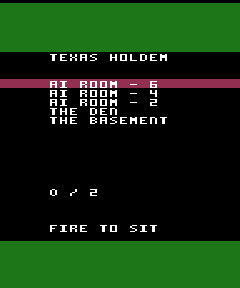 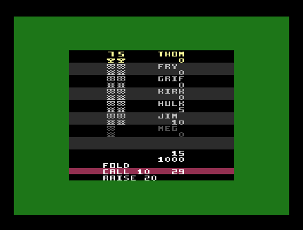 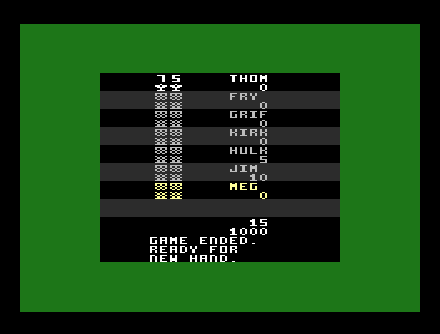

Each player gets two cards of their own, five cards in the middle are shared by all, and the best five-card hand wins. Up to eight players, with robots for empty seats.

**Loading.** Choose a table in the Lobby, or load **TEXAS.BIN** from **apps.irata.online / Atari_2600**. Pick an **AI ROOM** to learn against robots, or **THE DEN** or **THE BASEMENT** to play people.

**The table.** Your seat is at the top. Under each name are the player's two cards (yours face up) and chips. Below the eight seats are the **shared cards** — three, then four, then five — with the pot and your purse beside them; at the bottom, your moves and the seconds left. The controls are the same as 5 Card Stud's.

**Your first hand.** Two players post the **blinds**, **5** and **10**. Everyone gets two cards face down; each may **CALL**, **RAISE**, **FOLD** or **CHECK**. Three shared cards are dealt (the **flop**), then a fourth (the **turn**) and a fifth (the **river**), each with a betting round. At the showdown the best five-card hand from your two cards and the five shared ones takes the pot. Everyone starts with **$1,000**; about forty seconds a move.

## 14. Battleship

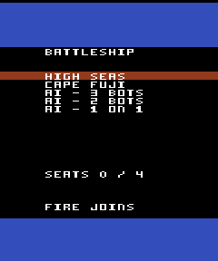 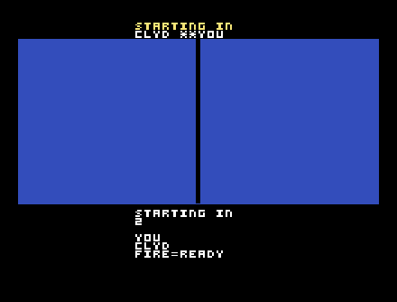 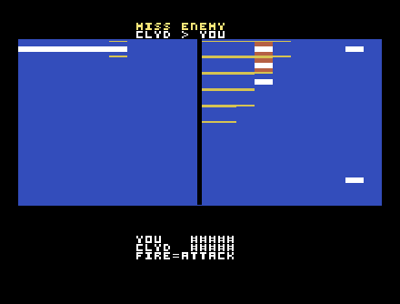

Two to four fleets on one ocean. Hide your five ships, then take turns firing — and every shot lands on **every** enemy board at once. The last fleet afloat wins.

**Loading.** Choose a Battleship table in the Lobby, or load **BATTLESHIP.BIN** from **apps.irata.online / Atari_2600**. The table list shows how many **SEATS** are taken; **FIRE JOINS**. The *AI* tables give you one, two or three robot admirals; *Cape Fuji* and *High Seas* are for people. In the waiting room press the red button when you are **ready**; the game starts when everyone is, or about thirty seconds after the first player sits down.

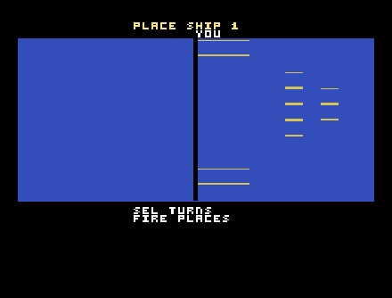

**Hiding your ships.** Five ships, 5, 4, 3, 3 and 2 squares long. The game starts you with a fleet already laid out — press the red button five times to keep it. Or move each ship with the joystick, turn it with **GAME SELECT** (*SEL TURNS*), and place it with the red button (*FIRE PLACES*). **WON'T FIT** means off the edge; **SHIPS TOUCH** means on another ship.

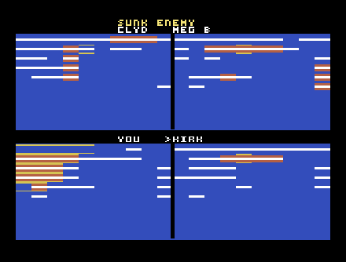

**Battle.** Every board is on the screen: two big ones for two players, four for three or four — yours at the bottom left. **Gold** marks your ships and your aim, **red** with a white middle is a hit, a **white** dash is a miss; each fleet's ships show as **#** afloat and **=** sunk. The top line tells you what happened last, whose turn it is and your seconds — *MISS YOU 45*, *HIT ENEMY*, *SUNK YOU 12* — and finally *YOU WIN!* or the winner's name.

| In battle | |
|---|---|
| Joystick | Aim. |
| **FIRE** | Fire at that square, on every enemy board at once. |
| **GAME SELECT** | Ask the server now. |
| **GAME RESET** | The **GAME MENU**: RESUME, HOW TO PLAY, LEAVE TABLE. |

You have **45 seconds** a turn. A square you have already fired at on every board is refused with a buzz.

## 15. Fujitzee

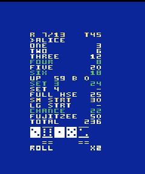

Roll five dice up to three times a turn, keep the ones you like, and score the result in one of thirteen boxes. After thirteen rounds the highest total wins. Up to six players, with robots on hand.

**Loading.** Choose a table in the Lobby, or load **FUJITZEE.BIN** from **apps.irata.online / Atari_2600**. Give your name if asked (**RST=DONE** — GAME RESET finishes). On **PICK A TABLE**, choose a table (**FIRE=JOIN**): *The Bar* and *Kitchen Table* are for people; the *AI Rooms* add two or four robots. Press the red button in the waiting room when you are ready.

**Your turn.** The pointer starts on **ROLL**; press the red button to roll. Move left and right along the dice; the red button **holds** a die (drawn as brackets, with a mark beneath). Roll again — up to three rolls. Push up onto the card: **green** lines show what this roll would score. Move to a box and press the red button. (Pressing the red button over and over plays a legal, if unwise, game.)

| Fujitzee | |
|---|---|
| Joystick | Left/right along the dice; up onto the card; up/down the boxes. |
| **FIRE** | Roll, hold a die, or score a box. In the waiting room, ready. |
| **GAME SELECT** | The **MENU**: RESUME, HOW TO PLAY, LEAVE TABLE. |
| **GAME RESET** | Ask the server now. |
| Left difficulty at **A** | Show everyone's standings. |

| Box | Scores |
|---|---|
| ONE through SIX | The total of the dice showing that number |
| UP | Your top-half total, and a bonus of 35 once it reaches 63 |
| SET 3, SET 4 | Three or four of a kind: the total of all five dice |
| FULL HSE | Three of one and two of another: 25 |
| SM STRT | Four in a row: 30 |
| LG STRT | Five in a row: 40 |
| FUJITZEE | All five the same: 50 |
| CHANCE | Anything: the total of all five dice |

Blue lines are boxes already filled; yellow is your pointer (or the box a robot just took). **45 seconds** a turn.

## 16. M.U.L.E.

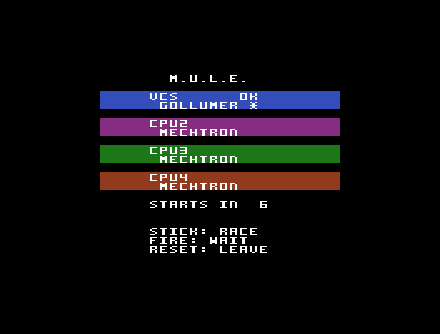 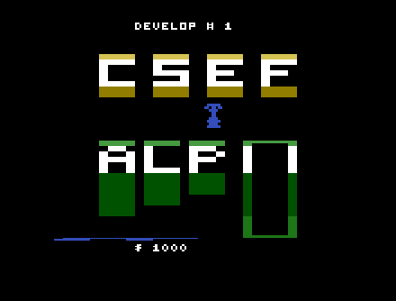 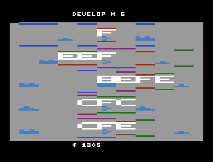

The classic game of settling the planet Irata, for four colonists on any FujiNet machine — the computer takes any empty seat. Choose **M.U.L.E.** and **Planet IRATA** in the Lobby, or load **MULE2600.BIN** from **apps.irata.online**, folder **mule / atari-2600**. Press the red button on the title screen (**FIRE: START**), give your name, pick a table (**FIRE: JOIN**; **RIGHT: RELOAD**), choose your race with the joystick and press the red button when you are ready.

| M.U.L.E. | |
|---|---|
| Joystick | Walk; choose; move your auction line; declare (up to sell, down to buy). |
| **FIRE** | Start, join and ready; claim a plot; begin your turn; install a M.U.L.E., take a sample, catch the Wampus; collude; sit out a declaration. |
| **GAME SELECT** | End your turn. |
| **GAME RESET** held a second | Leave the table; the computer takes over your colonist. |
| Left difficulty at **A** | Sound off. |

The map and town are drawn with letters: **F E S C** are Food, Energy, Smithore and Crystite M.U.L.E.s; in town **C S E F** are the outfitters and **A L P** the assay office, the land office and the pub. The whole game is in the *M.U.L.E. Player's Guide*, Atari 2600 edition.

## 17. Classics, Networked

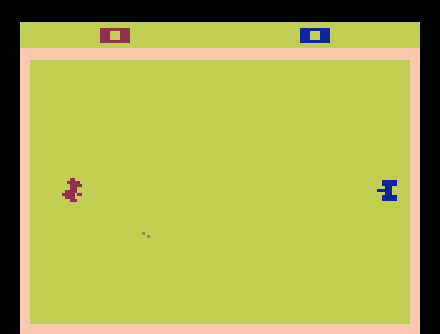 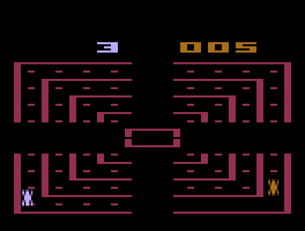 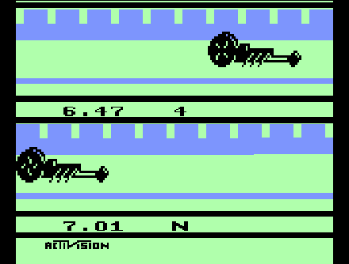 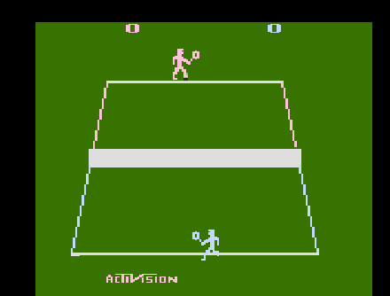 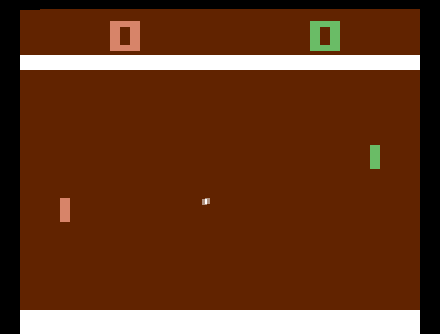

Some of the best games ever made for the 2600 were for two players side by side. The FujiNet project is teaching five of them to reach across the Internet — the same games, unchanged in how they look and play, with your opponent at their own console.

> **NOTE:** These five are being finished now. As each one is ready it will appear in the FujiNet Game Lobby. What follows is how they will play.

### How a Match Works

Both consoles run the whole game. All that travels between them is what each player does with the controller — fifteen times a second, through a **relay** on the Internet that pairs the first two players who arrive. Each console waits the same short moment (about an eighth of a second) before acting on **both** players' moves, so neither is ever ahead. If the other player's moves are late, the picture holds still for a moment rather than going wrong.

- Each player uses their own joystick in their own console's **LEFT CONTROLLER** jack.
- **GAME SELECT** and **GAME RESET** work from either console, and both games obey them at the same instant.
- The **TV TYPE** switch stays your own.
- If the two games ever disagree, they press GAME RESET together by themselves and start the round again.

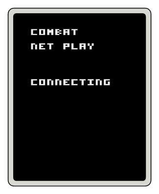 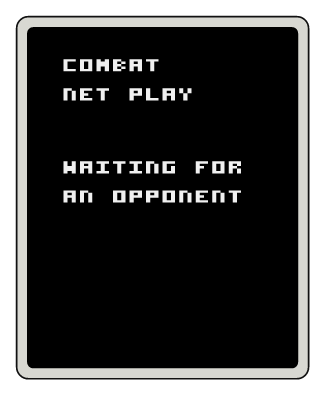 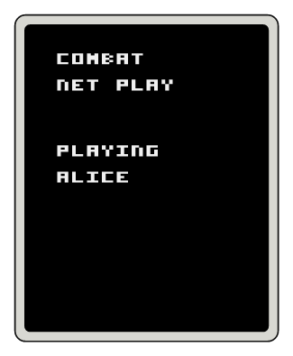 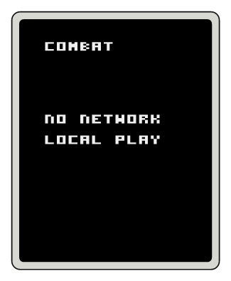

**CONNECTING**, then **WAITING FOR AN OPPONENT** until someone joins, then **PLAYING** and your opponent's name. With no network or relay, **NO NETWORK / LOCAL PLAY** for a moment, and then the old game starts as it always did, for two players on one console: press GAME RESET to play. If your opponent leaves, **OPPONENT HAS LEFT** — press GAME RESET to look for another.

| Game | Over the network |
|---|---|
| **Combat** (Atari, 1977) | The first player to arrive drives the left tank or plane. All 27 games. Choose the game with GAME SELECT **first**, then press GAME RESET. Each player's own left difficulty switch sets their own handicap. About 2 minutes 16 seconds a game. |
| **Dodge 'Em** (Atari, 1980) | Game 3, the two-player game: one of you collects the dots while the other drives the crash car, swapping every round. The difficulty switches cross the wire. |
| **Dragster** (Activision, 1980) | First player top lane, second low lane (**JOY RIGHT TO STAGE**). Stick right to stage; pull left to arm a gear and let go to take it — letting go is also the launch. The button is the throttle. GAME SELECT: straight race or the race with a drift. Start lights are shown a moment early so your launch is not late; network times run a touch slower. |
| **Tennis** (Activision, 1981) | The screen says PLAYER ONE or PLAYER TWO; you swap ends every game. The button serves; swings are automatic. GAME SELECT offers the two two-player games. Your difficulty switch limits your racket's angles and crosses the wire. |
| **Video Olympics** (Atari, 1977) | Paddles: each player plugs paddles into their own console's LEFT CONTROLLER and uses the first paddle. First player left side, second right. GAME SELECT steps through the 22 of its 50 versions two players can play. |

## 18. Maintenance

- Always turn the POWER switch OFF before putting the cartridge in or taking it out.
- Don't force the cartridge into the console.
- Don't push anything into the three small service holes.
- Push the memory card straight in and let it spring straight out.
- Use only a USB-C phone charger or a computer's USB port in the USB-C socket.
- Don't spill liquids on the cartridge or pour them into the console's slot; don't drop it or leave it in great heat.
- Clean the outside with a soft, slightly damp cloth.

FujiNet's firmware is improved all the time; new versions, and how to load them, are announced at [fujinet.online](https://fujinet.online). Loading new firmware does not change your hosts or your WiFi settings.

## 19. Trouble Shooting Checklist

| Symptom | Probable cause and remedy |
|---|---|
| No picture, or a grey or snowy screen | POWER not ON · TV not on channel 3, or the TV/Game switch at TV · cartridge not firmly seated (OFF, push it in, ON) · cartridge put in while the console was ON (slide POWER OFF and back ON) |
| The picture rolls or jumps when WiFi connects; the menu keeps starting over | Not enough power from the console: plug a USB-C charger into the cartridge · a PAL console or TV |
| The joystick does nothing | Joystick in RIGHT CONTROLLER — move it to LEFT · plug not fully home |
| My network is not in PICK NET | Router too far · a 5 GHz-only network (FujiNet needs 2.4 GHz) · a hidden network: choose OTHER... |
| WIFI FAILED | Wrong password — the bottom three keyboard rows are small letters. Press GAME SELECT, then WIFI on the hosts screen · or set WiFi from the memory card |
| Status light not white | Not on WiFi; see WIFI FAILED |
| A host shows nothing, or an error such as E03 FF | Host name misspelled · server not running or Internet down · SD: no card, or not FAT32 |
| BOOT FAILED | A game FujiNet cannot play yet · an 8K game that needs a `.CFG` · a damaged file |
| The game starts but is garbled or rolls | A PAL game · the wrong `.CFG` word |
| A game is not in the browser | Name does not end in .BIN or .ROM (rename `.A26`) · a FILTER is set |
| I cannot get back to the FujiNet menu | Press the RESET button on the cartridge, not GAME RESET · or turn the console OFF and ON |
| The Lobby says NO SERVERS | No tables open just now; load the game from the browser |
| A networked classic stays at WAITING FOR AN OPPONENT | Nobody else has joined yet |

As a rule of thumb, if something does not work, turn the console OFF, wait ten seconds, and turn it ON again.

## 20. Parts List

The FujiNet cartridge is open hardware. Its design files are in [fujinet-hardware](https://github.com/FujiNetWIFI/fujinet-hardware) under `ATARI-2600/Fujiversal-Atari2600-Rev1`.

| Part | |
|---|---|
| Board | Fujiversal-Atari2600 Rev1 |
| Game chip | RP2354A (RP2350 with 2 MB flash) |
| Network chip | ESP32-S3-WROOM-1, 16 MB flash, 8 MB PSRAM |
| WiFi | 802.11 b/g/n, 2.4 GHz |
| Memory card | microSD, push-push, FAT32 |
| USB | USB-C: power, and firmware loading |
| Lights | status (white / orange); power (red) |
| Buttons | RESET; three service buttons (BOOTSEL, S3 EN, S3 BOOT) |
| Power | from the console's cartridge port, or USB-C |
| Games | up to 32K; .BIN or .ROM; NTSC |
| Cartridge shell | 3D-printed, after norm8332's "Easy Print" shell (CC BY) |
| Shell screws | 4 × countersunk wood screw, #4 × 1/2" |

### Related Publications

- [FujiNet Programming Guide for the Atari 2600](FujiNet-Programming-Guide-for-the-Atari-2600) — writing programs for the cartridge
- *FujiNet for the Atari 2600: Theory of Operation* — how the cartridge works
- *M.U.L.E. Player's Guide*, Atari 2600 edition — the whole of M.U.L.E.
- *The FujiNet Network Protocol Handbook* — everything FujiNet can talk to

### A Few Words

| Word | Meaning |
|---|---|
| **Host** | A place games are kept: the memory card, or a server on the Internet or in your home. |
| **TNFS** | The simple file-sharing language FujiNet servers speak. |
| **Lobby** | FujiNet's list of open game tables, on every kind of machine. |
| **Relay** | A server that passes two players' moves to each other. |
| **SSID** | Your WiFi network's name. |
| **Firmware** | The programs built into the cartridge itself. |
| **Page-switching** | How a game bigger than 4K shows the console one part of itself at a time. FujiNet does it for the games it loads. |

### Getting Help

- [fujinet.online](https://fujinet.online) — news, downloads and the FujiNet wiki
- [github.com/FujiNetWIFI](https://github.com/FujiNetWIFI) — the source for everything, and the place to report a problem
- [discord.gg/7MfFTvD](https://discord.gg/7MfFTvD) — the FujiNet Discord

## Quick Reference

| Screen | Joystick | FIRE | GAME SELECT | GAME RESET |
|---|---|---|---|---|
| PICK NET | up/down: network | choose it | skip WiFi | — |
| Keyboard | move the ^ | type | ACCEPT · CANCEL · CLEAR | — |
| FN HOSTS | up/down: host | open it | INFO · RENAME · WIFI · LOBBY | — |
| FN BROWSE | up/down; right: next page; left: back page / up a folder | open folder · load game | UP DIR · FILTER · INFO · COPY · COPY HERE | — |
| LOBBY | up/down: table; left/right: page | join | your name | refresh |
| ENTER NAME (Lobby) | move | type | erase | done |
| 5 Card Stud, Texas Hold'em | up/down: move; right: poll; left: menu | make the move | hold: purses | TABLE MENU |
| Battleship: placing | move the ship | place it | turn it | GAME MENU |
| Battleship: battle | aim | fire | poll | GAME MENU |
| Fujitzee | dice; up to the card; up/down rows | roll · hold · score · ready | MENU | poll |
| M.U.L.E. | walk · choose · bid · declare | start · join · claim · install … | end turn | hold 1 s: leave |

**Left difficulty at A:** Fujitzee shows the standings; M.U.L.E. turns the sound off. **Cartridge RESET:** back to the FujiNet menu, from anywhere.

---

*This is the wiki edition of the* FujiNet Video Computer System Owner's Manual *(2026), typeset in print after the 1977 Atari* Video Computer System Owner's Manual. *FujiNet is not affiliated with Atari; "Atari", "Video Computer System", "Combat", "Video Olympics" and "Dodge 'Em" are trademarks of their owners, "Dragster" and "Tennis" are Activision titles, and "M.U.L.E." is a trademark of its owner. The cartridge shell is a re-model of norm8332's CC-BY "Atari 2600 Cartridge Shell — Easy Print".*
