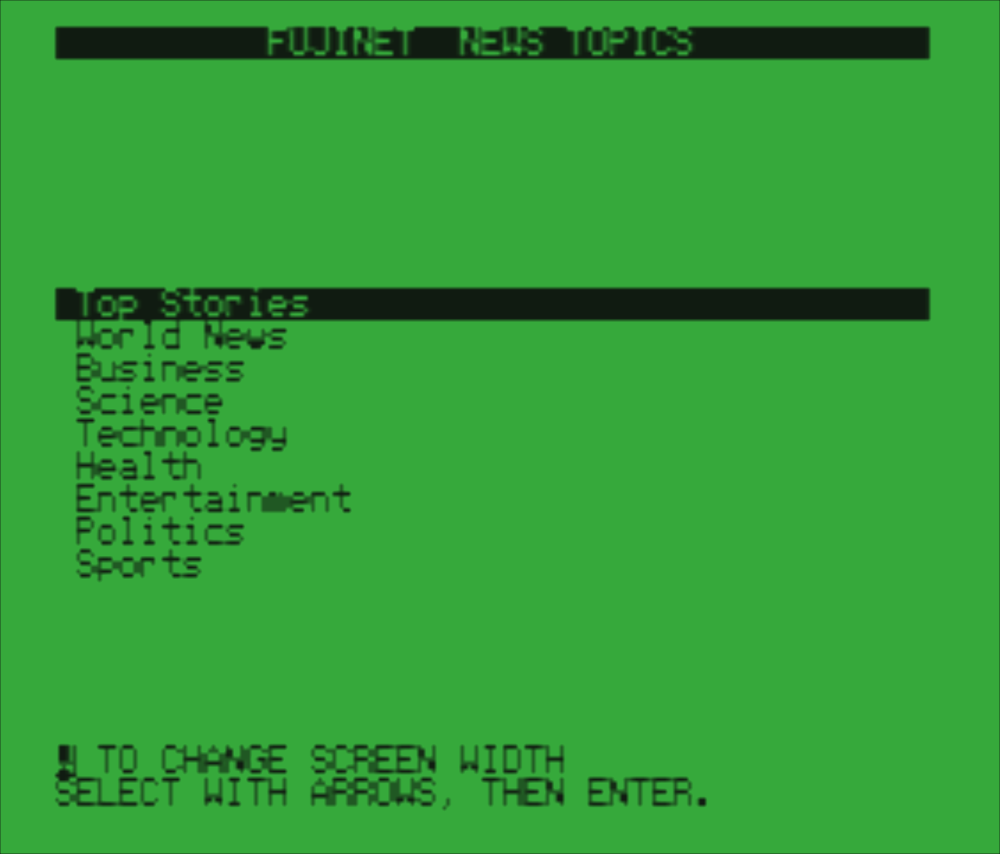
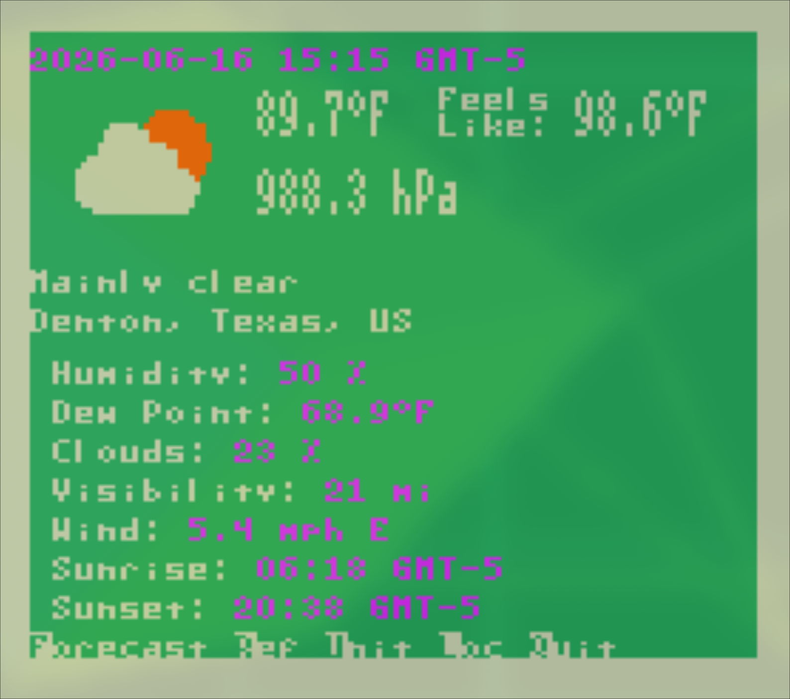
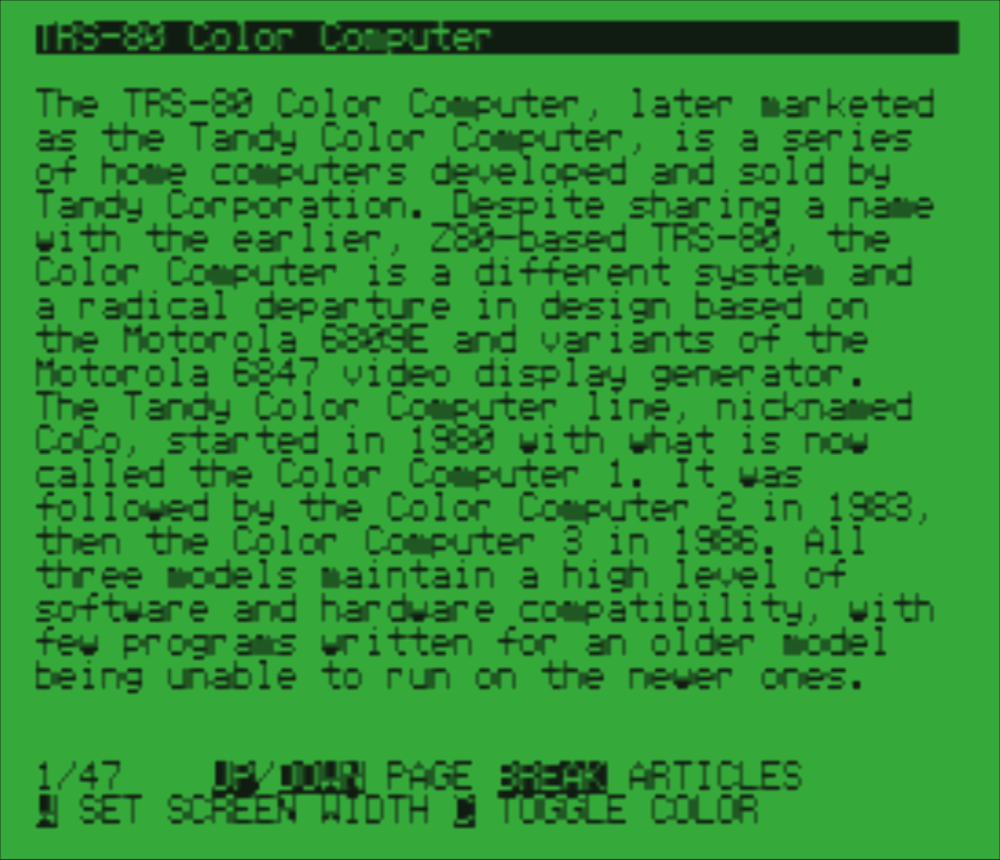
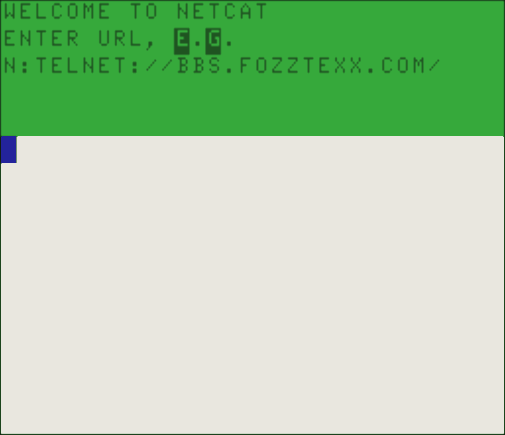

# Getting Started with FujiNet for the Color Computer

*Easy-to-follow instructions on setting up and using FujiNet and its CONFIG program with the TRS-80 Color Computer family — CoCo 1, 2, and 3, plus the Dragon 32/64. Written for first-time FujiNet users; no networking experience required.*

---

## Contents

1. [What Is FujiNet?](#what-is-fujinet)
2. [What You Need](#what-you-need)
3. [Know Your FujiNet](#know-your-fujinet)
4. [Setting the Model Switches](#setting-the-model-switches)
5. [Hooking Up Your FujiNet](#hooking-up-your-fujinet)
6. [First Power-Up](#first-power-up)
7. [Connecting to Your Wireless Network](#connecting-to-your-wireless-network)
8. [The Host Slots Screen](#the-host-slots-screen)
9. [Browsing a Host](#browsing-a-host)
10. [Loading a Disk Image](#loading-a-disk-image)
11. [The Drive Slots Screen](#the-drive-slots-screen)
12. [Leaving CONFIG and Booting](#leaving-config-and-booting)
13. [Creating a New Disk Image](#creating-a-new-disk-image)
14. [Copying Files Between Hosts](#copying-files-between-hosts)
15. [The Configuration Screen](#the-configuration-screen)
16. [The Web Control Panel](#the-web-control-panel)
17. [The Game Lobby](#the-game-lobby)
18. [Using HDB-DOS](#using-hdb-dos)
19. [The Program Library](#the-program-library)
20. [Troubleshooting](#troubleshooting)
21. [Updating the Firmware](#updating-the-firmware)
22. [Key Reference Charts](#key-reference-charts)
23. [Glossary](#glossary)
24. [Learning More](#learning-more)

---

## What Is FujiNet?

FujiNet is a wireless network adapter and multi-peripheral for your Color
Computer. The CoCo version — the **CoCoFuji** — is a Program-Pak-style
cartridge with an attached serial cable. It connects your CoCo to your
household WiFi network, and spends its life pretending to be something much
humbler: a stack of disk drives.

Instead of physical floppies, FujiNet uses **disk images** — exact,
byte-for-byte copies of disks stored as files. Disk images can live on a
microSD card inside the cartridge, on a file server on your own network, or
on public libraries across the internet. Your CoCo can't tell the
difference.

What the cartridge provides:

- **Four virtual disk drives** (drives 0–3, just like Disk Extended Color
  BASIC), served over the serial port using the DriveWire protocol
- **HDB-DOS in ROM** — a faithful, widely used extension of Disk Extended
  Color BASIC, so `DIR`, `LOAD`, `RUN`, and `SAVE` all work as you remember
- **The CONFIG program** — a menu-driven control panel that runs on the
  CoCo itself
- **WiFi** (2.4 GHz), a **microSD slot**, a **real-time clock**, a
  **printer capture** device, and a direct network channel for programs
  written to use it

## What You Need

- A FujiNet cartridge for the Color Computer (CoCoFuji Rev000 — the model
  currently in production)
- A TRS-80 Color Computer 1, 2, or 3 (or Dragon 32/64) with TV or monitor
- A 2.4 GHz WiFi network and its password
- *(Optional)* a microSD card, FAT32-formatted, 64 GB or smaller (8–32 GB
  from a reliable brand is plenty)

## Know Your FujiNet

Hold the cartridge label-up with the edge connector to the left:

- **White lamp** (by the `A` marking) — WiFi; glows steadily once
  connected to your network.
- **Orange lamp** (by the `↺` marking) — bus activity; flickers when the
  CoCo talks to the FujiNet, like a drive's busy lamp.
- **Model switches** — the small red 2-position DIP switch visible
  through the window in the case top (see next section).
- **Button A** — on the outer edge, nearest the `A` marking (closest to
  the CoCo's front when installed). Used when flashing firmware.
- **Reset button** — on the outer edge near the `↺` marking. Restarts the
  FujiNet itself, *not* the CoCo.
- **Micro-USB jack** — center of the outer edge; for firmware updates and
  optional power (it is diode-isolated and safe to use while the cart is
  installed).
- **microSD slot** — below the USB jack. Push to seat the card, push
  again to release. Label up.
- **Serial cable** — captive, exiting the rear corner, ending in a 4-pin
  DIN plug for the CoCo's SERIAL I/O jack.

There is no power supply: the FujiNet runs from the cartridge slot's 5V.

## Setting the Model Switches

The two switches select which HDB-DOS ROM image the CoCo boots — and the
serial speed the FujiNet uses. Set them *before* powering on:

| Your Computer    | Switch 1 (A14) | Switch 2 (A15) | Serial speed |
|------------------|----------------|----------------|--------------|
| Color Computer 1 | ON             | ON             | 38,400 baud  |
| Color Computer 2 | OFF            | ON             | 57,600 baud  |
| Color Computer 3 | ON             | OFF            | 115,200 baud |
| Dragon 32/64     | OFF            | OFF            | 57,600 baud  |

If your FujiNet arrived configured for your machine, leave them alone.

## Hooking Up Your FujiNet

> **WARNING:** The Computer must always be turned OFF whenever the FujiNet
> is plugged in or removed.

1. Turn off your Color Computer.
2. If you have a microSD card, insert it into the FujiNet's slot now.
3. Insert the cartridge into the CoCo's cartridge slot, label up. It only
   goes in one way.
4. Plug the round DIN plug on the FujiNet's cable into the jack marked
   **SERIAL I/O** on the back of the CoCo. Rotate gently until the pins
   line up, then press home.
5. Done — there's no power supply to connect.

## First Power-Up

Turn on the TV, then the CoCo. You'll see, in quick succession:

1. The green BASIC screen with the HDB-DOS banner, for a moment:

   ```
   DISK EXTENDED COLOR BASIC 1.1
   COPYRIGHT (C) 1982 BY TANDY
   UNDER LICENSE FROM MICROSOFT
   HDB-DOS 1.5 DW3 COCO 2
   OK
   ```

2. The FujiNet splash screen — the FUJINET logo over `LOADING CONFIG...`
   on a buff background — while CONFIG transfers. (Color fringes around
   the sharp edges on a television set are normal — that's NTSC artifact
   color.)

3. The CONFIG program. On the very first power-up it begins by scanning
   for WiFi networks.

**If it doesn't:** check that the TV is tuned to the computer (channel
3/4, antenna switch); that the cartridge and serial plug are seated; that
the model switches match your machine (a wrong setting = wrong serial
speed = a hang at the splash screen or a silent BASIC prompt). Then see
[Troubleshooting](#troubleshooting).

From now on, every power-up boots CONFIG. Press the CoCo's RESET button to
get BASIC back; type `DOS` and press ENTER to get CONFIG back.

## Connecting to Your Wireless Network

The scan screen lists every network the FujiNet can hear, with stars for
signal strength (three = excellent):

```
              WELCOME TO FUJINET
           MAC:D0:1C:ED:C0:FF:EE
HOMEBASE                    ***     <- highlight bar
COCO-NUT                    **
RAINBOW-GUEST               *

     UP/DOWN SELECT S SKIP
HIDDEN SSID RESCAN ENTER SELECT
```

In CONFIG, menu keys are shown in reverse video — the bright letter is the
key to press.

- **↑ / ↓** — move the bar
- **ENTER** — join the highlighted network
- **H** — type the name of a hidden network
- **R** — rescan
- **S** — skip WiFi setup

Then type the password (`ENTER NET PASSWORD, PRESS ENTER.`). Characters
echo as `*`, up to 64. Typing starts lowercase; hold SHIFT for capitals.
The left-arrow key erases. Press ENTER and the white lamp comes on.

The network is remembered inside the FujiNet (and in `FNCONFIG.INI` on the
SD card if present) — reconnection is automatic from then on.

> **NOTE:** The FujiNet hears 2.4 GHz networks only. If your router runs
> one name across 2.4 and 5 GHz and the FujiNet won't join, give the
> 2.4 GHz band its own name.

## The Host Slots Screen

A **host** is any place disk images live. The FujiNet remembers eight:

```
                      HOST SLOTS
1SD                                 <- highlight bar
2APPS.IRATA.ONLINE
3TNFS.FUJINET.ONLINE
4FUJINET.PL
5
6
7
8

1-8 SLOT EDIT ENTER BROWSE LOBBY
  CONFIG  -> DRIVES  BREAK QUIT
```

- **↑ / ↓** or **1–8** — choose a slot
- **E** — edit the slot: type a host name (up to 32 characters), ENTER
- **ENTER** — browse the highlighted host
- **→** — switch to the Drive Slots screen
- **C** — the Configuration screen
- **L** — the Game Lobby
- **BREAK** — leave CONFIG and boot

Slot 1 is the microSD card and always reads `SD`. Good public libraries to
add: `tnfs.fujinet.online` (CoCo software is in its `COCO` folder),
`apps.irata.online`, `fujinet.pl`. A live list of public TNFS servers is
at <https://fujinet.online/tnfs-server-status>. You can also run a free
TNFS server on your own PC/Mac/Linux box — see the FujiNet wiki.

## Browsing a Host

Press ENTER on a host to open its catalog. Entries ending in `/` are
folders:

```
TNFS.FUJINET.ONLINE
/

ADAM/
APPLE2/
ATARI/
CBM/
COCO/
LINKS/

← ../ UP/DN MOVE ↑UP/↑DN PAGE
ENTER OR BREAK FILTER NEW COPY
```

- **↑ / ↓** — move the bar; ten entries show per page, and the list pages
  automatically at the top/bottom. **SHIFT+↑/↓** leaps a whole page.
- **ENTER** — open a folder / choose a disk image
- **←** — back out to the enclosing folder
- **F** — enter a filter (wildcards like `W*.*`; prefix `!` to search all
  subfolders recursively; empty filter clears)
- **BREAK** — back to Host Slots

Long file names scroll by themselves when the bar rests on them. `[...]`
at the list edge means more pages.

## Loading a Disk Image

Choose a `.DSK` file and CONFIG asks where to put it:

```
           PLACE IN DEVICE SLOT:
0                                   <- highlight bar
1
2
3

                    FILE DETAILS
  MTIME: 2026-05-30 16:20:08
   SIZE: 157 K

                        NEWS.DSK
   ARROW KEYS  TO SELECT SLOT
 ENTER R/O W R/W OR BREAK ABORT
```

- **↑ / ↓** — pick drive slot 0–3 (drive 0 is what the CoCo boots)
- **ENTER** — load **read-only** (like a write-protected floppy)
- **W** — load **read/write** (programs can save to the image)
- **BREAK** — cancel

> Public libraries refuse writes — use read-only for them, and save **W**
> for images on your own SD card or local server.

## The Drive Slots Screen

From Host Slots, press **→**:

```
                     DRIVE SLOTS
03▓NEWS.DSK                         <- highlight bar
1
2
3

0-3 SLOT EJECT  CLEAR  ALL SLOTS
<- HOSTS READ WRITE CONFIG LOBBY
```

Each line: drive number, the host slot it came from, a colored mode block,
and the image name. **Blue block = read-only, yellow = read/write, black =
empty.**

- **0–3** or **↑ / ↓** — choose a drive
- **R / W** — change the highlighted drive's mode
- **E** — eject the image
- **CLEAR** — eject everything
- **←** — back to Host Slots

## Leaving CONFIG and Booting

Press **BREAK** from the Host Slots or Drive Slots screen. CONFIG prints
`MOUNTING ALL SLOTS...` and the CoCo restarts into HDB-DOS BASIC with your
disks loaded. If the disk in drive 0 carries a BASIC program named
`AUTOEXEC.BAS`, it runs automatically (an OS-9 disk with a boot track
boots, too). Otherwise you land at `OK` — try `DIR`.

(That's also how CONFIG itself works: the FujiNet quietly serves CONFIG's
own disk to drive 0 at startup, and its AUTOEXEC.BAS launches the menu.)

## Creating a New Disk Image

While browsing a writable host, press **N**:

1. `ENTER # OF DRIVES TO CREATE` — answer `1` (each "drive" is one 157K
   virtual diskette; multi-disk images are an HDB-DOS power feature)
2. `ENTER FILENAME:` — `.DSK` is appended if you forget

The image appears in the current folder, blank — no formatting needed.
Load it read/write and `SAVE` away.

## Copying Files Between Hosts

Highlight a file in the catalog and press **C**. Choose the destination
host (e.g. `SD`), walk to the destination folder, and press **C** again.
The FujiNet copies the file by itself:

```
              COPYING FILE FROM:
             TNFS.FUJINET.ONLINE
/COCO/NEWS.DSK

                COPYING FILE TO:
                              SD
/NEWS.DSK
```

## The Configuration Screen

Press **C** from Host Slots or Drive Slots:

```
     FUJINET CONFIGURATION
                           SSID:
                        HOMEBASE
                       HOSTNAME:
                         FUJINET
      IP: 192.168.1.73
 NETMASK: 255.255.255.0
     DNS: 192.168.1.1
     MAC: D0:1C:ED:C0:FF:EE
   BSSID: A4:2B:8C:11:0D:E5
   FNVER: V1.5.2

 CHANGE SSID          RECONNECT
OR  ANY KEY  TO RETURN TO HOSTS
```

- **C** — change WiFi network (back to the scan screen)
- **R** — reconnect
- any other key — back to Host Slots

## The Web Control Panel

While the CoCo is on, browse to the FujiNet's IP address (from the
Configuration screen) from any modern computer or phone on your network.
You can rename the device, manage WiFi, pick printer emulations, adjust
options, and update firmware from there.

## The Game Lobby

Press **L** from Host Slots or Drive Slots; answer `BOOT TO LOBBY? Y/N`
with **Y**. The Lobby is a live directory of on-line multiplayer games —
Five Card Stud, Battleship, Fujitzee, and more — playable against real
people on Ataris, Apple IIs, PCs, and other CoCos:

```
#FUJINET GAME LOBBY     THOMCOCO
--------------------------------
5 CARD STUD              PLAYERS
 AI ROOM - 2 BOTS            0/6    <- highlight bar
 AI ROOM - 4 BOTS            0/4
 AI ROOM - 6 BOTS            0/2
 THE BASEMENT                0/8
 THE DEN                     0/8

BATTLESHIP
 AI - 1 ON 1                 0/4
 AI - 2 BOTS                 0/4
 AI - 3 BOTS                 0/4
--------------------------------
SELECT GAME, PRESS ENTER TO PLAY
REFRESH LIST    QA   CHANGE NAME
```

Pick a table and press ENTER — bots are always seated, people drop in
all evening. **R** refreshes the room list and **C** changes your player
name.

> If your firmware doesn't offer **L** yet, load `LOBBY.DSK` from
> `tnfs.fujinet.online`'s `COCO` folder into drive 0 and press BREAK.

## Using HDB-DOS

Everything Disk Extended Color BASIC does, HDB-DOS does: `DIR`,
`RUN"GAME"`, `LOADM`/`EXEC`, `SAVE`, `BACKUP`, `COPY`, `KILL`, `RENAME`.
Useful extras:

- **RUNM** — `RUNM"PROG.BIN"` loads *and* runs a machine-language program
  in one step.
- **DRIVE #n** — switch the default drive with a `#`: `DRIVE #1`.
- **AUTOEXEC.BAS** — a BASIC program with this name on the drive 0 disk
  runs automatically at boot.
- **FLEXIKEY** — the right-arrow key replays the last line you typed one
  character at a time; SHIFT+right-arrow replays the rest at once;
  SHIFT+left-arrow abandons the line.

A read-only image refuses `SAVE` like a write-protected floppy — flip it
to W in the Drive Slots screen first. The full HDB-DOS manual is free at
cloud9tech.com (the FujiNet team didn't write HDB-DOS and can't modify
it).

## The Program Library

Free, FujiNet-aware programs in `tnfs.fujinet.online`'s `COCO` folder —
load one into drive 0 and leave CONFIG:

**NEWS.DSK** — a wire-service news reader (topics, headlines, full
stories; 32/42-column on CoCo 1/2, native 40/80 on CoCo 3)



**WEATHER.DSK** — conditions and forecasts anywhere; finds your location
automatically; imperial/metric



**WIKI.DSK** — search and read Wikipedia, with a 42-column
true-lowercase display on CoCo 1/2



**NETCAT.DSK** — a telnet terminal for BBSes:
`N:TELNET://BBS.EXAMPLE.COM:23` — recent versions speak VT-52



**LOBBY.DSK** — the Game Lobby, if you'd rather boot it directly

Programmers: the same network channel is available to your own BASIC, C
(cmoc + fujinet-lib), or assembly programs. Start at
<https://github.com/FujiNetWIFI> and the Discord.

## Troubleshooting

| Symptom | Cure |
|---------|------|
| CONFIG doesn't appear at power-up | Reseat cartridge (power OFF first); check serial plug is in **SERIAL I/O** (the 4-pin DIN — the cassette jack next door has 5); check model switches; check TV channel/antenna switch |
| BASIC appears, `DOS` hangs; or garbage | Model switches set for the wrong machine — wrong serial speed |
| Scan finds no networks / won't connect | 2.4 GHz only — split your router's bands; **H** for hidden networks; passwords are case-sensitive (SHIFT for capitals) |
| Host slot won't open | Check spelling with **E**; try `TNFS.FUJINET.ONLINE`; for `SD` check the card is seated and FAT32 |
| Disk won't boot | The CoCo boots drive 0 — is your disk there? Many images are data disks: `DIR` then `RUN` what you find |
| Can't `SAVE` (`?WP ERROR`) | Image is read-only — press **W** on it in Drive Slots; public libraries never accept writes — copy the image to SD first |
| White lamp never lights | Not connected — redo WiFi setup; it's also off for a few seconds at every power-up while reconnecting |
| FujiNet seems frozen | Press the cartridge's reset button (↺), wait a few seconds, press the CoCo's RESET, type `DOS` |

## Updating the Firmware

1. Get **FujiNet-Flasher** from <https://fujinet.online/download> on a
   modern computer (Windows may need the SiLabs CP210x "Universal"
   driver).
2. Power off the CoCo. Connect a USB cable (micro-USB end) from your
   computer to the FujiNet.
3. In the flasher: pick the serial port, leave the baud rate at 460800,
   choose platform **Tandy CoCo** and the newest release.
4. Click **Flash FujiNet Firmware**, then hold the FujiNet's **A button**
   (the one closest to the CoCo's front) until writing begins.
5. Disconnect the cable before powering the CoCo back up.

The flasher's **Serial Debug Output** button shows a live log of what the
FujiNet is doing — the first thing the community will ask for if you
report a mystery. Nightly test builds also exist; they are strictly
as-is.

## Key Reference Charts

**Everywhere:** the bright (reverse-video) letter is the key to press.

| Screen | Keys |
|--------|------|
| WiFi scan | ↑↓ move · ENTER select · H hidden · R rescan · S skip |
| Host Slots | 1–8 slot · E edit · ENTER browse · → drives · C config · L lobby · BREAK boot |
| Catalog | ↑↓ move (auto-page) · SHIFT+↑↓ page · ENTER open/choose · ← up-folder · F filter · N new image · C copy · BREAK hosts |
| Place in slot | ↑↓ slot · ENTER read-only · W read/write · E eject · BREAK abort |
| Drive Slots | 0–3 slot · R/W mode · E eject · CLEAR eject all · ← hosts · C config · L lobby · BREAK boot |
| Configuration | C change SSID · R reconnect · any key back |

## Glossary

- **CoCoFuji** — the FujiNet cartridge for the Color Computer.
- **Disk image** — a file containing an exact copy of a disk (`.DSK`).
- **DriveWire** — the CoCo-standard protocol for serving disks over the
  serial port; what the FujiNet speaks to your CoCo.
- **HDB-DOS** — the Disk Extended Color BASIC extension in the
  cartridge's ROM.
- **Host** — any place disk images live: a TNFS server or the SD card.
- **TNFS** — the simple file-server protocol used by FujiNet libraries.
- **Virtual diskette** — one 161,280-byte (35-track) disk inside an
  image: "157K."

## Learning More

- FujiNet web site: <https://fujinet.online>
- FujiNet wiki: <https://github.com/FujiNetWIFI/fujinet-firmware/wiki>
- Discord: link at fujinet.online — friendly and quick
- FujiNet Users Group on Facebook
- HDB-DOS manual: <https://www.cloud9tech.com>
- This manual's print edition (a 1980 Operation Manual tribute):
  `coco/getting_started/` in the
  [fujinet-manuals](https://github.com/FujiNetWIFI/fujinet-manuals)
  repository
