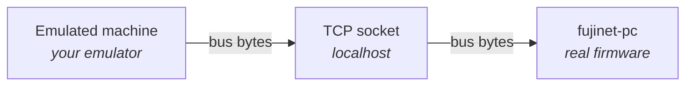
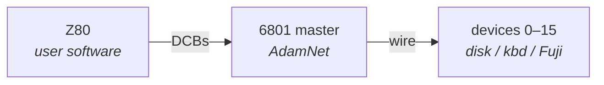
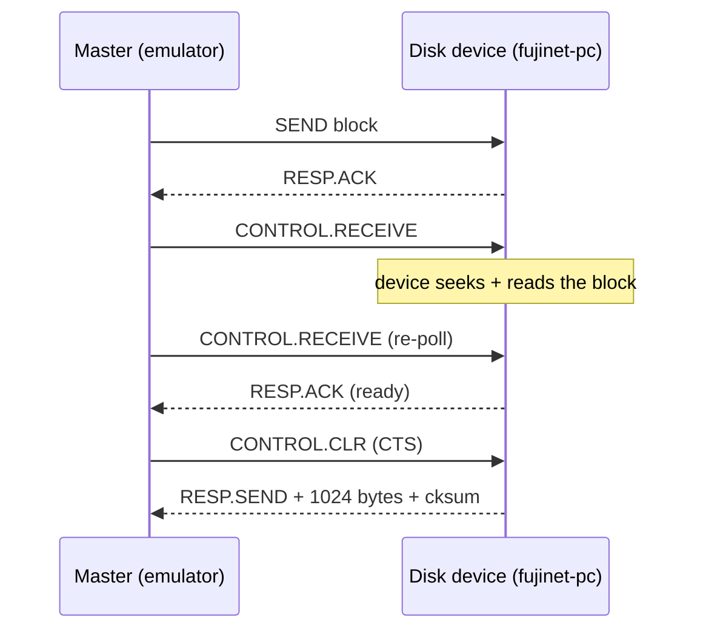
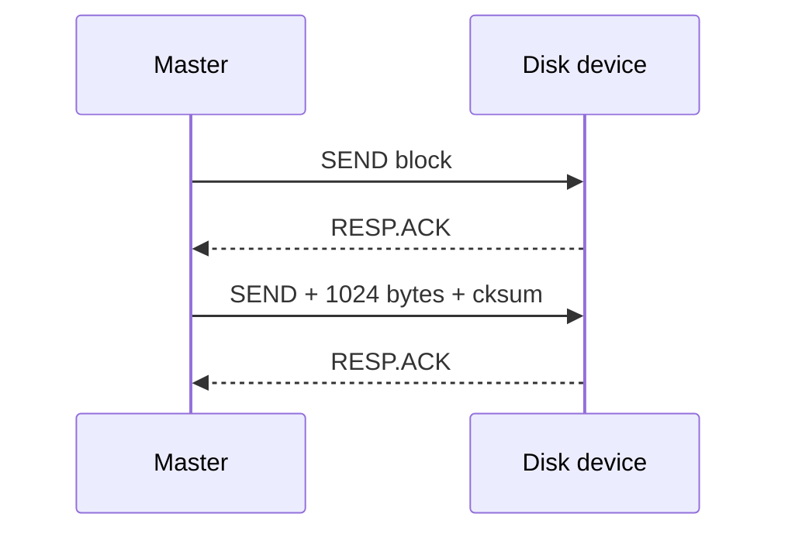
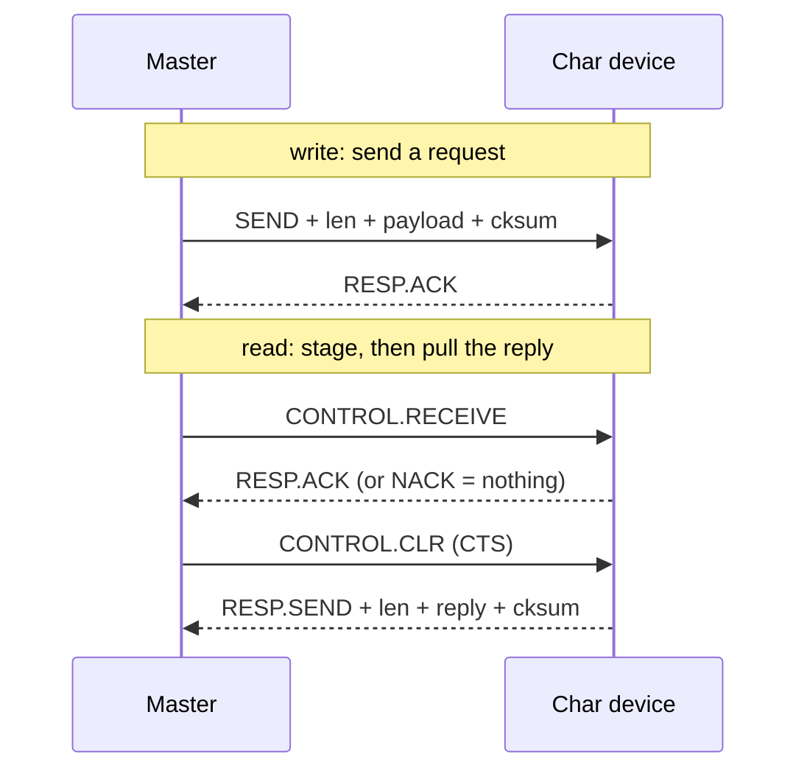
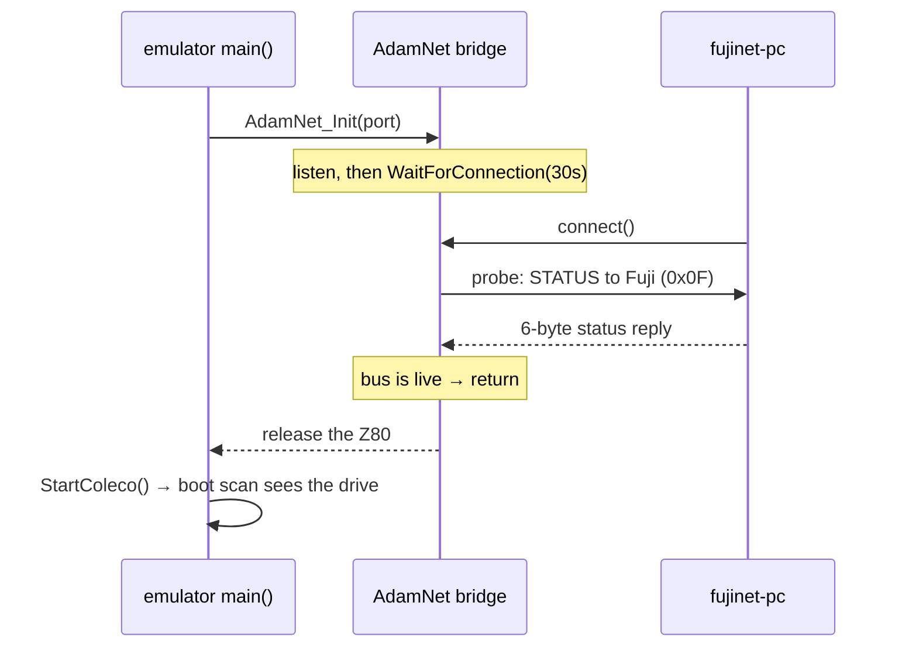

# Connecting an Emulator to FujiNet-PC

*A developer's guide to adding FujiNet support to a vintage-computer
emulator, by carrying the machine's peripheral bus over a socket to the
FujiNet firmware running on your desktop.*

**Worked example:** the Coleco ADAM emulator **ADAMEm** (`adamem_sdl`) ↔
**fujinet-pc** built for the ADAM target (`fujinet-pc-adam`).

> This is the GitHub-wiki edition of the print manual
> (`connecting-an-emulator-to-fujinet-pc.pdf`). The two are kept in sync by
> hand. Every packet field, register value, timeout, and source excerpt is
> transcribed from the live project sources: `adamem_sdl`, `fujinet-pc-adam`,
> and `fujinet-firmware`.

## Contents

- **Part I — The Idea:** [Introduction](#introduction) ·
  [Why give your emulator a FujiNet](#why-give-your-emulator-a-fujinet) ·
  [The Bus-over-IP architecture](#the-bus-over-ip-architecture)
- **Part II — The Bus You Will Speak:** [AdamNet](#adamnet-the-adams-peripheral-bus) ·
  [The wire protocol](#the-adamnet-wire-protocol)
- **Part III — Adapting the Emulator:** [Finding the seam](#finding-the-seam) ·
  [Transport](#the-transport-layer) · [Master state machine](#the-master-state-machine) ·
  [Routing](#routing-device-io-to-fujinet) · [Boot handshake](#startup-and-the-boot-handshake) ·
  [Building](#building-and-running)
- **Part IV — Getting It Right:** [The echo](#the-half-duplex-echo) ·
  [Seek stall](#slow-media-the-seek-stall-and-duplicate-ack-desync) ·
  [Non-blocking reads](#dont-freeze-the-machine-non-blocking-reads) ·
  [Throttling](#dont-storm-the-kernel-throttled-polling) ·
  [Timeouts](#timeout-budgets-for-lossy-links) ·
  [The peripheral's view](#the-peripherals-point-of-view)
- **Part V — Your Turn:** [A recipe for any emulator](#a-recipe-for-any-emulator) ·
  [Running fujinet-pc](#running-fujinet-pc-as-your-reference-peripheral) ·
  [Appendices](#appendix-a--adamnet-wire-protocol-reference)

---

# Part I — The Idea

## Introduction

FujiNet is a network and storage peripheral for retro computers. To a 1980s
machine it looks like a fast disk drive, a printer, an RS-232 modem, a clock,
and network adapters; behind that façade an ESP32 fetches files over Wi-Fi,
mounts disk images from a TNFS server anywhere on the internet, parses JSON,
and serves a configuration program.

This guide is for the maintainer of an **emulator**. You can give the software
running inside your emulator a *genuine* FujiNet — not a partial
reimplementation, but the **actual FujiNet firmware** running as an ordinary
program on the same PC (`fujinet-pc`), reachable over a socket. The trick has
three pieces:



The emulator keeps emulating CPU, video, sound, and keyboard. The one thing it
stops pretending to be is the **peripheral bus** — the wire that, on real
hardware, connects the machine to its disk drives and to the FujiNet
cartridge. Instead of synthesising disk replies itself, it carries those bus
transactions, byte for byte, over a TCP socket to `fujinet-pc`, which answers
exactly as the hardware FujiNet would.

| Component | Role |
|---|---|
| **ADAMEm** (`adamem_sdl`) | A mature Coleco ADAM emulator. We add a bridge that turns it into the *AdamNet master* for a chosen set of device IDs. |
| **fujinet-pc** (ADAM target) | The FujiNet firmware compiled for the desktop. It already speaks AdamNet; only the *transport* changed, so the bus arrives over a socket instead of a UART. |

**Who this is for:** the author of an emulator who knows their own codebase.
You do not need to know FujiNet's internals, AdamNet, or the ADAM — those are
taught here. What you *do* need is a clear picture of where, inside your
emulator, the emulated software talks to its peripherals. That is the seam we
cut ([Finding the seam](#finding-the-seam)).

## Why give your emulator a FujiNet

### You ship the real firmware, not a clone

The naïve approach — reimplement the peripheral inside the emulator — always
drifts. The real device gains a command or changes a status byte; the
hand-written clone does not, and software that works on hardware fails under
emulation. Bus over IP runs **the same firmware the hardware runs**, built for
a different CPU. There is exactly one implementation of "what FujiNet does,"
and both hardware and emulator use it.

### What your users get

- **Disks from anywhere** — local folders, microSD images, or TNFS servers on
  the public internet.
- **The genuine `CONFIG` experience** — the same configuration program a real
  FujiNet boots.
- **Live network apps** — the worked example boots `fujinet-connect-four.ddp`
  and an ISS tracker that fetches the station position over HTTP, in the
  emulator.
- **A safe place to learn** before buying hardware.

### What the FujiNet project gets

- **Edit-compile-run in seconds** — no flashing an ESP32.
- **A real debugger** — `gdb`, `valgrind`, ASan all work on `fujinet-pc`.
  Several real bugs were found the first time the ADAM code ran on PC at all.
- **CI without hardware** — boot a disk and assert in a headless job.

### And you, the emulator author

You don't have to become a FujiNet expert or maintain a network stack. Your
responsibility ends at the bus — a small surface for a large feature.

> **The one prerequisite:** the FujiNet firmware must be PC-buildable for your
> platform. For ADAM, Atari, Apple II, CoCo, and the RS-232 platforms it
> already is. If yours is not, that is a *firmware* task (see
> [Running fujinet-pc](#running-fujinet-pc-as-your-reference-peripheral)).

## The Bus-over-IP architecture

### The roles: master and peripheral

On real hardware the CPU talks to a **bus** with a protocol, and one side is
in charge: the **master** issues commands and expects timely replies;
**peripherals** listen and answer when addressed. Bus over IP preserves these
roles and assigns them across the two programs:


The emulator becomes the **bus controller**, not an application client. It
sends the same command bytes, in the same order, with the same timing
expectations, and interprets replies with the same state machine. The firmware
cannot tell whether the commands came from a 6801 over a UART or an emulator
over a socket — which is why two whole chapters teach the wire protocol before
any socket code appears.

### The transport: a socket carrying raw bus bytes

What travels over TCP is **the raw bytes of the peripheral bus** — not JSON,
not an RPC. The socket is a dumb pipe standing in for a piece of wire. This
keeps the firmware side almost unchanged: it reads bus bytes from a socket
instead of a UART, and everything above that is untouched.

### Who connects to whom

```mermaid
sequenceDiagram
    participant E as Emulator (master)
    participant F as fujinet-pc (peripheral)
    Note over E: listens on a TCP port
    F->>E: connect()
    E-->>F: accepted; bus is live
    E->>F: AdamNet command bytes…
    F-->>E: …AdamNet response bytes
```

The **emulator is the TCP server** (`listen()`); **fujinet-pc is the client**
(`connect()`s in, retrying quietly until the emulator is up). So `fujinet-pc`
can run as a background service that keeps trying, while the emulator comes and
goes.

### The lineage: NetSIO

This is a direct descendant of the Atari world's **NetSIO**
(`fujinet-emulator-bridge`), which connects the Altirra emulator to
`fujinet-pc` over a UDP hub. The ADAM work mirrors it on purpose.

| | Atari (NetSIO) | ADAM (this guide) |
|---|---|---|
| Bus | SIO | AdamNet |
| Master | Altirra (emulator) | ADAMEm (emulator) |
| Peripheral | fujinet-pc | fujinet-pc |
| Transport | UDP via a hub | direct TCP |
| Listener | the hub | the emulator |
| Default port | 9997 | 65216 |

---

# Part II — The Bus You Will Speak

## AdamNet: the ADAM's peripheral bus

The Coleco ADAM's peripherals are a small *network*. The Z80 that runs user
software does **not** drive the peripherals; a second processor — a 6801
**network master** — owns a serial bus called **AdamNet**, and every
peripheral is itself a little 6801 node on that bus.



Two consequences shape the whole adaptation:

1. **The seam in the emulator is the master.** ADAMEm does not emulate each
   peripheral node; it emulates the *6801 master* well enough to run the wire
   protocol. When we forward a device, ADAMEm becomes the master for it.
2. **There are two protocols.** Between Z80 and master sits the **DCB**
   protocol; between master and devices sits the **AdamNet wire** protocol.
   FujiNet lives on the wire side, so the emulator must translate between them.

### Device IDs

| ID | Device | Forwarded to FujiNet? |
|---|---|---|
| `0x01` | Keyboard | No — stays local |
| `0x02` | ADAMNet printer | Yes (char device) |
| `0x04`–`0x07` | Disk drives 1–4 | Yes (block devices) |
| `0x08` | Tape | No — stays local |
| `0x09`–`0x0E` | Network adapters | Yes (char devices) |
| `0x0F` | Fuji "gateway" device | Yes (char device) |

> **For your emulator.** Your platform has the same two layers in some form: a
> high-level way the OS asks for I/O (ADAM DCBs; Atari CIO/SIO call blocks; an
> MS-DOS `INT`) and a low-level bus protocol underneath. Find both. **The seam
> you cut is between them.**

## The AdamNet wire protocol

Defined byte-for-byte in `fujinet-firmware`'s `lib/bus/adamnet/adamnet.h` and
mirrored in the emulator's `AdamNet.c`.

### Byte format

AdamNet is a **half-duplex one-wire serial bus at 62500 baud**. Control is
carried in single bytes: **high nibble = operation, low nibble = device**.

```c
#define CMD(c,dev)  (unsigned char)(((c) << 4) | ((dev) & 0x0F))
#define RESP(r,dev) (unsigned char)(((r) << 4) | ((dev) & 0x0F))
```

So "STATUS to device `0x0F`" = `CMD(MN_STATUS,0x0F)` = `0x1F`; the status reply
= `RESP(NR_STATUS,0x0F)` = `0x8F`.

### Command and response codes

| Code | Master command | Code | Device response |
|---|---|---|---|
| `0x0` `MN_RESET` | reset | `0x8` `NR_STATUS` | status packet |
| `0x1` `MN_STATUS` | get status | `0x9` `NR_ACK` | ack |
| `0x2` `MN_ACK` | ack | `0xA` `NR_CANCEL` | cancel |
| `0x3` `MN_CLR` | clear-to-send | `0xB` `NR_SEND` | data packet |
| `0x4` `MN_RECEIVE` | stage data | `0xC` `NR_NACK` | nack / nothing |
| `0x5` `MN_CANCEL` | cancel | | |
| `0x6` `MN_SEND` | payload follows | | |
| `0x7` `MN_NACK` | nack | | |
| `0xD` `MN_READY` | ready? | | |

(The firmware spells the responses `NM_*`; the emulator spells them `NR_*` —
same values.)

### Packets, length, checksum

A packet is `[code|dev] [len16] [payload…] [checksum]`. The **checksum is a
simple 8-bit XOR** of every payload byte — *not* an additive checksum, and not
the add-with-carry fold the tandem platforms' FujiBus uses:

```c
static unsigned char an_checksum(const unsigned char *buf, int len) {
    unsigned char ck = 0;
    for (int i = 0; i < len; ++i) ck ^= buf[i];
    return ck;
}
```

### The status packet

`MN_STATUS` always elicits a fixed **6-byte** reply:
`[0x8|dev] [len lo] [len hi] [devtype] [status] [cksum]`, where `devtype` is
`0x01` (block) or `0x00` (char). A well-formed reply starting with `0x8|dev`
means the device is alive and speaking AdamNet — we use this as a liveness
probe at boot.

### The block-read handshake (1024-byte blocks)



1. **Name the block:** a 5-byte `MN_SEND` packet with the 32-bit block number
   (little-endian) + a trailing zero. Device ACKs.
2. **Ask for it (`MN_RECEIVE`):** the device fetches the block. While busy it
   stays **silent**, so the master **re-polls** `MN_RECEIVE` until it gets an
   ACK. This re-poll loop is the source of most Part IV pitfalls.
3. **Pull the data (`MN_CLR`):** the device streams `NR_SEND` + a **big-endian**
   length of 1024 + the 1024 bytes + a checksum.

### The block-write handshake



### The character-device handshake



A char read **must** issue `RECEIVE` before `CLR`: that is what stages the
device's pending data into its response buffer. Skip it and the device NACKs
the `CLR` (the response length is still zero).

> The char path is marked **experimental** in `AdamNet.h` — the
> DCB-op-to-wire mapping for char devices is not fully validated against EOS.
> Disk + status are the proven path that boots disks and runs `CONFIG`.

---

# Part III — Adapting the Emulator

## Finding the seam

The one decision you cannot copy: **where do you cut?** Find the narrowest
place where the emulated software's *peripheral intent* is fully formed but not
yet turned into fake hardware behaviour. Cut too high and you re-implement the
OS; cut too low and you reconstruct intent from bit-banged edges.

In ADAMEm, that place is the **Device Control Block** handler. The Z80 fills a
DCB in shared RAM (command, buffer address, length, block number) and pokes the
master; ADAMEm's `UpdateDCB()` in `Coleco.c` is the stand-in for the 6801
master. The device ID is decoded on the first line:

```c
dev_id = (RAM[(DCB+9)&0xFFFF] << 4) + (RAM[(DCB+16)&0xFFFF] & 0x0F);
```

**The intercept is four lines** added at the top of `UpdateDCB()`:

```c
dev_id = (RAM[(DCB+9)&0xFFFF]<<4) + (RAM[(DCB+16)&0xFFFF]&0x0F);
if (AdamNet_IsForwarded(dev_id) && AdamNet_Connected()) {
    UpdateFujiNet(mode, dev_id, DCB);
    return;
}
switch (dev_id) { /* ...emulator's own keyboard/tape/disk handling... */ }
```

The two predicates matter:

- `AdamNet_IsForwarded(dev_id)` keeps keyboard (`0x01`) and tape (`0x08`)
  local, so the emulator's input and cassette keep working.
- `AdamNet_Connected()` means that **until `fujinet-pc` connects, the emulator
  behaves exactly as it always did.** The bridge is purely additive — a user
  who never passes `-fujinet` sees no change.

> **For your emulator.** Find your `UpdateDCB`: the Atari SIO device-vector
> dispatch, a CoCo DriveWire handler, an `INT 13h/21h` shim. It is always a
> single function that already receives a fully-formed request and knows where
> the answer goes. Add the same two-predicate guard.

## The transport layer

A TCP listener plus push/pull helpers with timeouts (`AdamNet.c`). The least
platform-specific code in the project.

### The emulator listens

```c
int AdamNet_Init(int port) {
    an_listen_fd = socket(AF_INET, SOCK_STREAM, 0);
    setsockopt(an_listen_fd, SOL_SOCKET, SO_REUSEADDR, &on, sizeof(on));
    /* bind INADDR_ANY:port, listen(), then: */
    fcntl(an_listen_fd, F_SETFL, O_NONBLOCK);
    return 0;
}
```

`AdamNet_Connected()` polls `accept()` on the non-blocking listener so the
emulator's main loop never stalls, and sets `TCP_NODELAY` on the accepted
connection.

> **`TCP_NODELAY` is not optional.** AdamNet is a tight one-byte-at-a-time
> handshake. With Nagle on, the kernel sits on your single-byte `MN_RECEIVE`
> for up to 40 ms. Both ends set it (`fujinet-pc` too).

### Bytes in, bytes out

`an_recv()` reads exactly `len` bytes or fails after `timeout_ms`, via
`select()`:

```c
static int an_recv(unsigned char *buf, int len, int timeout_ms) {
    int got = 0, n;
    while (got < len) {
        /* select() on an_conn_fd with tv = timeout_ms */
        n = select(an_conn_fd+1, &rfds, NULL, NULL, &tv);
        if (n == 0) return -1;             /* timed out */
        n = recv(an_conn_fd, buf+got, len-got, 0);
        if (n > 0) { got += n; continue; }
        if (n < 0 && errno == EINTR) continue;
        an_disconnect(); return -1;
    }
    return 0;
}
```

A timeout of **zero** makes it a **non-blocking peek** — return a byte if one
is waiting, else fail immediately. That single property lets a disk read poll
the socket without stalling the CPU. `an_drain()` (a zero-timeout poll loop
that discards queued bytes) exists for a pitfall covered later.

## The master state machine

These functions *are* the 6801 master, reimplemented against a TCP stream. One
function per logical operation; each maps onto a handshake from the wire
protocol.

### Naming a block

```c
static int an_send_block_num(int dev, unsigned long block) {
    unsigned char pkt[5];
    pkt[0]= block & 0xFF; pkt[1]=(block>>8)&0xFF;      /* LE32 block #     */
    pkt[2]=(block>>16)&0xFF; pkt[3]=(block>>24)&0xFF; pkt[4]=0x00;
    if (an_send_byte(CMD(MN_SEND,dev))) return -1;
    if (an_send_byte(0x00)) return -1;                 /* length high 0x05 */
    if (an_send_byte(0x05)) return -1;
    if (an_send(pkt,5)) return -1;
    if (an_send_byte(an_checksum(pkt,5))) return -1;
    if (an_recv_byte(TMO_ACK) != RESP(NR_ACK,dev)) return -1;
    return 0;
}
```

### Reading a block (blocking version)

```c
int AdamNet_ReadBlock(int dev, unsigned long block, unsigned char *buf) {
    if (an_send_block_num(dev, block)) return -1;       /* 1. name block   */
    gettimeofday(&t0, NULL);
    for (;;) {                                          /* 2. RECEIVE re-poll */
        if (an_send_byte(CMD(MN_RECEIVE,dev))) return -1;
        r = an_recv_byte(TMO_RECV_POLL);
        if (r == RESP(NR_ACK,dev)) break;
        if (r == RESP(NR_NACK,dev)) return -1;
        if (r < 0) { if (an_ms_since(&t0) > TMO_RECV_TOTAL) return -1; continue; }
        return -1;
    }
    an_drain();                                         /* drop surplus ACKs */
    if (an_send_byte(CMD(MN_CLR,dev))) return -1;       /* 3. CLR → data    */
    do { if (an_recv(hdr,1,TMO_DATA)) return -1; } while (hdr[0]==RESP(NR_ACK,dev));
    if (hdr[0] != RESP(NR_SEND,dev)) return -1;
    if (an_recv(hdr+1,2,TMO_DATA)) return -1;
    len = (hdr[1]<<8)|hdr[2];                           /* big-endian length */
    if (len != ADAMNET_BLOCK_SIZE) return -1;
    if (an_recv(buf, ADAMNET_BLOCK_SIZE, TMO_DATA)) return -1;
    if (an_recv_byte(TMO_DATA) < 0) return -1;          /* checksum         */
    return 0;
}
```

Three details, each a Part IV pitfall in miniature: the **`RECEIVE` re-poll
loop** (seek tolerance), **`an_drain()` before `CLR`** (duplicate-ACK fix), and
the **`do/while` skipping a stray ACK** before the data header.

### Writing; character devices; reset

`AdamNet_WriteBlock` names the block then sends 1024 bytes (length spelled
`0x04,0x00`, big-endian). `AdamNet_CharRead` issues `RECEIVE` (to stage) then
`CLR` (to pull), tolerating a NACK at either step as "nothing available."
`AdamNet_ResetDevice` sends a single `MN_RESET` byte, optionally broadcast to
every forwarded device.

> **For your emulator.** This is the chapter you rewrite most for another
> platform — it is literally your bus's transactions. The shape transfers: one
> C function per operation, each a straight-line `send`/`recv`-with-timeout
> sequence returning 0 or −1. **Build the status probe first** (it is smallest).

## Routing device I/O to FujiNet

`UpdateFujiNet()` translates between the **DCB** world and the **wire** world.

### The forwarding mask

```c
static unsigned long an_forward_mask =
    (1UL<<0x02) |                                            /* printer   */
    (1UL<<0x04)|(1UL<<0x05)|(1UL<<0x06)|(1UL<<0x07) |        /* disks     */
    (1UL<<0x09)|(1UL<<0x0A)|(1UL<<0x0B)|
    (1UL<<0x0C)|(1UL<<0x0D)|(1UL<<0x0E) |                    /* network   */
    (1UL<<0x0F);                                             /* Fuji      */
```

### DCB memory layout

| Offset | Field | Use |
|---|---|---|
| `+0` | status / command | Z80 writes the op; master writes the result back |
| `+1,+2` | buffer address (LE) | where data is read into / written from |
| `+3,+4` | byte count (LE) | capped at 1024 |
| `+5..+8` | block number (LE32) | which 1024-byte block |
| `+9` / `+16` | device ID high / low nibble | `dev_id = RAM[+9]<<4 \| (RAM[+16]&0x0F)` |
| `+17,+18` | block size | master writes 1024 (`0x0400`) on status |
| `+20` | status flags | media-present / error bits |

Command in `RAM[DCB]`: 0 clear · 1 status · 2 reset · 3 write · 4 read. Result
written back: `0x80` success · `0x9B` error · **bit 7 clear = still busy, ask
again** (load-bearing for non-blocking reads).

### Translating a block operation

```c
if (dev_id>=4 && dev_id<=7) {                /* block device (disk) */
  switch (RAM[DCB]) {
    case 1:                                  /* status */
      if (AdamNet_DiskStatus(dev,&st)==0) {
        RAM[DCB]=0x80;
        RAM[(DCB+17)&0xFFFF]=0x00; RAM[(DCB+18)&0xFFFF]=0x04;  /* size=1024 */
        RAM[(DCB+20)&0xFFFF]&=0xF0;           /* media present */
      } else RAM[DCB]=0x9B;
      break;
    case 3: case 4:                          /* write / read */
      addr =RAM[(DCB+1)&0xFFFF]+RAM[(DCB+2)&0xFFFF]*256;
      count=RAM[(DCB+3)&0xFFFF]+RAM[(DCB+4)&0xFFFF]*256;
      block=RAM[(DCB+5)&0xFFFF] | (RAM[(DCB+6)&0xFFFF]<<8)
           | (RAM[(DCB+7)&0xFFFF]<<16) | ((unsigned long)RAM[(DCB+8)&0xFFFF]<<24);
      if (count>1024) count=1024;
      if (RAM[DCB]==4) {                      /* read */
        if (AdamNet_ReadBlock(dev,block,buf)==0) {
          for (i=0;i<count;++i) RAM[(addr+i)&0xFFFF]=buf[i];
          RAM[DCB]=0x80;
        } else { RAM[(DCB+20)&0xFFFF]|=6; RAM[DCB]=0x9B; }
      } else { /* write: copy RAM→buf, AdamNet_WriteBlock, set status */ }
      break;
  }
}
```

The `&0xFFFF` on every RAM index makes a top-of-memory wrap match the real
Z80. A pure DCB **read** (the Z80 polling the status byte) returns early — the
last result already sits in `RAM[DCB]`:

```c
/* mode 0 is the Z80 reading the DCB status byte: the result of the last
   command already sits in RAM[DCB], so just leave it. */
if (!(mode & 127)) return;
```

This poll-driven re-entry is the hook the non-blocking read hangs off. Build a
verbose trace in from line one (`-verbose 8` logs each forwarded op and result).

> **For your emulator.** Gate on forwarded-and-connected, decode the request,
> dispatch to the matching transaction, copy results into the machine's
> memory, set a status the OS understands. You will live in the verbose trace.

## Startup and the boot handshake

### The option

`-fujinet [port]` enables the bridge; the port is optional and defaults to
**65216** (`ADAMNET_DEFAULT_PORT`), chosen so it doesn't collide with other
platforms' BoIP defaults (Atari NetSIO 9997, an Apple relay 1985).

### Wait for the peripheral before booting

At power-on the ADAM scans AdamNet for a boot device; if none answers it falls
through to the built-in **SmartWriter** word processor. So `main()` waits — up
to 30 s — for a **responsive** peer before starting the CPU:

```c
if (FujiNetPort > 0) {
    AdamNet_Init(FujiNetPort);
    if (!AdamNet_WaitForConnection(30000))
        printf("AdamNet: no fujinet-pc connected; booting anyway "
               "(press F12 to reboot once it connects).\n");
}
StartColeco();
```



### Probe, don't just accept

A bare TCP connection is not proof the peer speaks AdamNet — it could be a
different platform's FujiNet that grabbed a shared port. So the emulator probes
the Fuji device's status and **drops a peer that does not answer AdamNet within
3 s**, then keeps waiting for the real one:

```c
while (an_ms_since(&tp) < 3000 && an_ms_since(&t0) < timeout_ms) {
    if (AdamNet_DiskStatus(0x0F, &st) == 0) { /* live → boot */ return 1; }
    usleep(50000);
}
/* not answering: probably the wrong fujinet — drop it and keep waiting. */
if (an_conn_fd >= 0) { close(an_conn_fd); an_conn_fd = -1; }
```

> **For your emulator.** Boot ordering matters (wait for the peripheral before
> releasing the CPU if your machine gives up on absent boot media), and a
> connection is not a contract (probe that the peer speaks your bus).

## Building and running

Four edits to `Makefile.SDL`:

1. Add `AdamNet.o` to `OBJECTS`.
2. Declare deps: `AdamNet.o: AdamNet.c AdamNet.h`, and add `AdamNet.h` to
   `ADAMEm.o` and `Coleco.o`.
3. **Link dynamically:** `sdl2-config --libs`, *not* `--static-libs`. A static
   link can break `getaddrinfo`, which the socket layer needs for TNFS host
   resolution.
4. Optionally enable verbose tracing (`-DPRINT_MEM -DPRINT_IO`).

```text
# 1. Emulator listens on 65216 and waits for fujinet-pc.
$ ./adamem -fujinet game.ddp
# 2. fujinet-pc (ADAM target) connects to localhost:65216 by default.
$ ./fujinet-pc
```

With `-verbose 8`:

```text
AdamNet: listening for fujinet-pc on TCP port 65216
AdamNet: fujinet-pc connected
AdamNet: probing fujinet bus...
AdamNet: fujinet bus is live; booting.
[FujiNet] dev=0x0F op=1 DCB=FC10
[FujiNet] dev=0x0F -> result=0x80
```

Those last two lines are the whole system working: the ADAM asked the Fuji
device for status, and the real firmware answered success — over a socket.

---

# Part IV — Getting It Right

The first version booted a local disk and looked finished. It was not. Five
pitfalls separate "it boots" from "it boots reliably over a laggy TNFS link
without the music stuttering," plus a sixth on the peripheral's side.

## The half-duplex echo

AdamNet is physically a **single wire**: when anyone transmits, *everyone* —
including the sender — hears it. The firmware relies on this; after sending a
response it reads back and discards the echo of its own transmission to know
the wire is clear (`drain_echo()`/`wait_for_idle()`).

A point-to-point TCP socket does **not** echo. So `NetAdamNet::dataOut()`
appends its own transmitted bytes to its own RX FIFO — a **local echo** that
reproduces the one-wire behaviour:

```cpp
size_t NetAdamNet::dataOut(const void *buffer, size_t length) {
    // Local echo: reproduce the one-wire half-duplex echo so the bus service's
    // drain_echo()/wait_for_idle() consume our own transmission, not the
    // master's next command.
    _fifo.append((const char *)buffer, length);
    /* ...then send() it over the socket... */
}
```

This is the payoff of carrying **raw bus bytes**: the firmware's bus logic
stays byte-for-byte identical to hardware, and the one place reality differs
(the missing echo) is patched in the transport with three lines.

**The emulator must not echo and must not expect an echo.** Read only what the
device actually sends. Looping the master's transmissions back would feed the
firmware's echo logic twice and desync everything.

## Slow media: the seek stall and duplicate-ACK desync

*(`adamem_sdl` commit `30248a5`)* — the most instructive bug, invisible until
the disk got slow. It booted perfectly from local storage and failed every
time over TNFS.

After naming the block, the master **re-polls `MN_RECEIVE` every few ms** while
the device seeks. On a slow TNFS read the device stays silent for tens of ms
and the master re-polls many times. When the block arrives the device ACKs
**each** buffered re-poll — several `RESP.ACK` bytes are now queued. The master
broke out on the first ACK, sent `CLR`, then read a **leftover ACK** where the
data header `0xB0|dev` belonged. The read failed and the stream desynced,
cascading to the next block.

**The fix:**

1. **`an_drain()`** after the re-poll loop wins its ACK, before `CLR` — drops
   the surplus ACKs.
2. **Skip a stray leading ACK** before the data header:
   `do { recv(hdr,1) } while (hdr[0]==RESP(NR_ACK,dev));`

The same commit widened `TMO_DATA` 1500→8000 ms and `TMO_RECV_TOTAL`
800→8000 ms so a genuinely slow fetch isn't cut off (on localhost these never
fire).

> **The canonical "works on my machine" bug:** fast local media masks a
> protocol-timing flaw only a slow remote device exposes. Test against a
> distant TNFS host before believing the disk path is correct.

## Don't freeze the machine: non-blocking reads

*(`adamem_sdl` commit `117fc14`)* — TNFS boots were now *correct* but *ugly*:
sound stuttered and video hitched during multi-block loads.

`AdamNet_ReadBlock()` runs synchronously, called from the Z80's DCB access,
called from the **CPU emulation loop**. While the master spins re-polling for a
slow block (tens of ms), the emulated Z80 is not executing — and on the ADAM
the sound and video interrupts are driven *by the CPU*. Freeze the Z80 and the
music driver stops advancing.

**Fix: do it the way the hardware does** — issue the command, poll status while
it completes. Split the read:

```c
int AdamNet_ReadBlockBegin(int dev, unsigned long block);  /* kick off      */
int AdamNet_ReadBlockReady(int dev, unsigned char *buf);   /* 1 done 0 busy -1 err */
```

`Begin` sends the block number + first `RECEIVE`. `Ready` is a **non-blocking
peek** (zero-timeout) that finishes the transaction, reports still-seeking, or
errors. `UpdateFujiNet()` leaves the DCB **busy** (bit 7 clear) and services
the in-flight read on each DCB access. EOS *already* spins reading the DCB
status — that spin *is* the service tick — so the Z80 keeps running between
calls, interrupts fire, and the music plays. One read in flight at a time
(EOS is sequential).

> **Never run a multi-millisecond bus transaction inside the CPU loop.** Model
> it as a state machine the CPU polls, mirroring how the real OS waits on real
> hardware. If your OS polls a busy flag, that poll is your service tick.

## Don't storm the kernel: throttled polling

*(`adamem_sdl` commit `63a8b72`)* — the non-blocking read fixed the stutter and
introduced a subtler one: the music's *tempo* became slightly uneven.

EOS spins reading the DCB status **thousands of times per frame**, and the
first `ReadBlockReady()` peeked the socket on every call — a `select()`+`recv()`
**syscall storm** that overran the frame budget; the pacer skipped and caught
up, landing interrupts (and the music) unevenly.

**Fix: gate the socket access on `gettimeofday()`** — a vDSO read, not a
syscall, so nearly free — and only touch the socket ~once per ms:

```c
gettimeofday(&now, NULL);
us = elapsed_since(&an_rb_poll, &now);
if (us < 1000) return 0;          /* throttle: report "pending" immediately */
an_rb_poll = now;
/* ...only now do the select()/recv() peek... */
```

> Correctness is not cost. When a hot path is driven by an emulated CPU's
> busy-wait, the per-call cost is multiplied by a number you didn't choose.
> Make the common "nothing yet" answer as cheap as a comparison.

## Timeout budgets for lossy links

*(`adamem_sdl` commit `fda05e7`)* — a one-line change. FujiNet's TNFS layer
retries a dropped request up to ~**8 times at 2000 ms each** (~16 s). With an
8 s budget the master gave up mid-read while FujiNet was still legitimately
retrying; the ADAM re-requested, FujiNet started over, and a big `.ddp` boot
crawled.

```c
/* FujiNet may retry a lossy TNFS read up to ~8 x 2000ms, so wait longer
   than that before giving up. */
#define TMO_RECV_TOTAL 20000
```

On localhost/SD it never fires. It is safe because EOS keeps polling the busy
DCB and only re-requests on the master's *error* return.

> **The master's patience must exceed the peripheral's worst-case recovery
> time.** Three retry loops interact (peripheral, master, OS); size the master
> as the most patient for transient slowness and let the OS be the backstop.

## The peripheral's point of view

Changes on the **fujinet-pc** side. You did not write these, but they define
the contract your master relies on.

### The 300 µs response deadline

Real AdamNet is hard-real-time: a device must begin responding within **300 µs**
or the master assumes it is dead, and the firmware enforces this by **not
transmitting** a late response (on hardware it would collide with the master's
next action). Over a socket a slow PC easily blows 300 µs, so a per-device flag
waives it — **but only for devices the master re-polls**:

```cpp
// PC/BoIP only: always transmit ACK/NACK even past the 300us window (a slow
// host can blow it). Safe only for devices the master re-polls (block devices);
// single-shot char/network devices keep the deadline so a late response can't
// pollute the next command's reply.
bool _pc_no_response_deadline = false;
```

| Device class | Deadline | Why |
|---|---|---|
| Block (disk) | waived | master re-polls `RECEIVE`; a late ACK answers the next poll |
| Fuji + network | waived | also re-polled in the BoIP path; slow HTTP/JSON would miss the window |
| Single-shot char | enforced | not re-polled — a late reply would corrupt the next command |

This is the mirror of the master's re-poll loop: the master re-polls *because*
the device might be slow; the device may answer late *because* the master
re-polls. Co-designed.

### The shared-port problem & polite reconnection

The firmware uses a **distinct default port per platform** (`BUILD_ADAM` →
`CONFIG_DEFAULT_BOIP_PORT 65216`), complementing the emulator's probe. And
because `fujinet-pc` may run for hours waiting for an absent emulator, it
**resolves the host once** and logs the "waiting" notice **once per offline
period**, retrying at one attempt/second — patient, silent, auto-reconnecting.

> **For your emulator.** The contract: late responses are tolerated for
> re-polled devices (so your re-poll loop is load-bearing), the port is
> platform-specific (match it), and the peer reconnects on its own (accept a
> fresh connection at any time, not just at startup).

---

# Part V — Your Turn

## A recipe for any emulator

1. **Confirm the firmware builds for PC** for your platform's device suite.
2. **Learn your bus's wire protocol** from the firmware's own bus code.
3. **Find the seam** — the one function that already brokers a full request.
   Add a forwarded-and-connected guard.
4. **Open a dumb pipe** — a stream socket of raw bus bytes; `TCP_NODELAY`; a
   `recv`-with-timeout and a zero-timeout peek.
5. **Build the master state machine** — one function per operation; status
   probe first.
6. **Write the translator** — decode, dispatch, copy results into memory, set a
   status; trace every op.
7. **Get boot ordering right** — wait for a peer that *answers your bus* before
   releasing the CPU.
8. **Make it reliable under load** — drain stale ACKs; non-blocking reads on the
   OS's status poll; throttle that poll; master timeout above the peripheral's
   worst-case retry.

### Concept map

| Concept | ADAM (this guide) | Yours — fill in |
|---|---|---|
| Bus master | 6801 → `UpdateDCB` | your I/O dispatcher |
| Wire protocol | AdamNet (62500-baud one-wire) | SIO / DriveWire / … |
| High-level request | DCB in RAM | SIO block / INT regs / … |
| The seam | `UpdateDCB()` in `Coleco.c` | ? |
| Liveness probe | STATUS to Fuji `0x0F` | your cheapest exchange |
| Async hook | EOS polls DCB status byte | your OS's completion poll |
| Default BoIP port | 65216 | pick a distinct one |

## Running fujinet-pc as your reference peripheral

Build the ADAM PC target:

```text
$ ./build.sh -p ADAM
```

The desktop build has **no real AdamNet hardware**, so for `BUILD_ADAM` on PC,
**BoIP is on by default**, pointed at `localhost:65216` — it connects to your
emulator with no configuration. The transport is chosen in
`systemBus::setup()`:

```cpp
#else  // PC build
    if (Config.get_boip_enabled()) {
        _netadam.begin(Config.get_boip_host(), Config.get_boip_port());
        _port = &_netadam;          // bus reads/writes go to the socket
    } else { _serial.begin(...); _port = &_serial; }
#endif
```

Everything above `_port` — every device, media handler, the command processor —
is identical to the hardware build. Trace from `_port` outward to read exactly
the code your emulator exercises. Once connected and booted into `CONFIG`, you
use FujiNet through the emulated machine exactly as on hardware (host/slot
management also via the web UI).

**If your platform's firmware is not PC-ready yet,** the ADAM needed: a
FreeRTOS/`esp_timer` shim (`lib/compat/pc_rtos`) so the bus task/queues/timers
run as `std::thread`s; file I/O through `fnFile`/`FileHandler` (so TNFS works —
a `FILE*` media handler cannot read from TNFS); and shaking out latent bugs
exposed by running on a real OS with real tools. It is bounded firmware work,
and the gate everything else waits behind.

---

## Appendix A — AdamNet wire-protocol reference

**Byte format:** high nibble = code, low nibble = device (0–15).
`CMD(c,dev) = (c<<4)|(dev&0x0F)`.

See the [command/response table](#command-and-response-codes) above.

**Packet:** `[code|dev] [len16] [payload…] [checksum]`. Checksum = XOR of all
payload bytes. Block size = 1024. Status reply (6 bytes):
`[0x8|dev] [len lo] [len hi] [devtype] [status] [cksum]` — `devtype` 0x01 block,
0x00 char.

- **Block read:** `SEND blk#(5,LE32+0)` → `ACK`; `RECEIVE` (re-poll until
  `ACK`); `CLR` → `SEND`+`len(BE=1024)`+1024 bytes+`cksum`.
- **Block write:** `SEND blk#` → `ACK`; `SEND`+`len(BE=1024)`+1024
  bytes+`cksum` → `ACK`.
- **Char read:** `RECEIVE` → `ACK`/`NACK`; `CLR` → `SEND`+`len(BE)`+data+`cksum`.

## Appendix B — Device Control Block reference

See the [DCB layout table](#dcb-memory-layout) above. Commands: 0 clear, 1
status, 2 reset, 3 write, 4 read. Result: `0x80` ok, `0x9B` err, bit 7 clear =
busy.

## Appendix C — ADAMEm command-line & tunables

| Option | Abbrev | Effect |
|---|---|---|
| `-fujinet [port]` | `-fn` | Enable AdamNet-over-IP; listen on `[port]` (default 65216), wait ≤30 s for a responsive peer before booting |
| `-verbose 8` | | Log each forwarded DCB op + result to `stderr` |

| Tunable (`AdamNet.c`) | Value / meaning |
|---|---|
| `ADAMNET_DEFAULT_PORT` | 65216 (matches `CONFIG_DEFAULT_BOIP_PORT`) |
| `TMO_ACK` | 300 ms — ACK / status reply |
| `TMO_DATA` | 8000 ms — data-packet bytes |
| `TMO_RECV_POLL` | 5 ms — per `RECEIVE` re-poll |
| `TMO_RECV_TOTAL` | 20000 ms — ride out a TNFS-retry seek |
| `ADAMNET_BLOCK_SIZE` | 1024 |
| `an_forward_mask` | bitmask of forwarded device IDs |

## Appendix D — Troubleshooting

| Symptom | Likely cause / cure |
|---|---|
| Boots to SmartWriter, not `CONFIG` | Z80 released before the peer answered. Confirm `fujinet-pc` is running; press F12 to reboot once connected. |
| Connects but every op fails | Probe failing or wrong peer on the port. Check `-verbose 8`; confirm same port and the *ADAM* build. |
| Local disks boot, TNFS disks stall | Duplicate-ACK desync / short timeouts. Ensure `an_drain()` before `CLR` and `TMO_RECV_TOTAL`=20 s. |
| Audio/video stutters during loads | Blocking read freezing the CPU. Use non-blocking `ReadBlockBegin`/`Ready`, leave DCB busy. |
| Music tempo subtly uneven | Socket syscall storm from the EOS status spin. Throttle behind `gettimeofday`. |
| Handshake slow (~40 ms/op) | `TCP_NODELAY` not set on one end. Set it on both. |
| TNFS hostname won't resolve | Statically linked emulator. Link dynamically (`sdl2-config --libs`). |
| Char/network reads come back empty | Missing `RECEIVE` before `CLR`; the device never staged its response. |

## Appendix E — Source map

| File / commit | Contains |
|---|---|
| `adamem_sdl/AdamNet.c` `.h` | TCP transport + AdamNet master state machine |
| `adamem_sdl/Coleco.c` | `UpdateDCB()` intercept + `UpdateFujiNet()` translator + forwarding + trace |
| `adamem_sdl/ADAMEm.c` | `-fujinet [port]` option, init, wait-for-peer in `main()` |
| `adamem_sdl/Makefile.SDL` | `AdamNet.o`, deps, dynamic link |
| commit `d0f79b0` | the bridge: transport, master, routing, option |
| commit `30248a5` | seek-stall duplicate-ACK fix (`an_drain`, timeouts) |
| commit `117fc14` | non-blocking reads (`ReadBlockBegin`/`Ready`) |
| commit `63a8b72` | throttled async-read polling |
| commit `fda05e7` | widened `TMO_RECV_TOTAL` for TNFS retries |
| `fujinet-pc-adam/lib/hardware/NetAdamNet.*` | socket IOChannel + local echo |
| `fujinet-pc-adam/lib/bus/adamnet/*` | transport selection, response deadline, idle handling |
| commit `b0e57228b` | ADAM PC target + NetAdamNet + RTOS/fnFile shims |

## Glossary

- **AdamNet** — the Coleco ADAM's 62500-baud half-duplex one-wire peripheral bus.
- **Bus over IP (BoIP)** — carrying a machine's peripheral-bus bytes over a
  socket between an emulator and `fujinet-pc`.
- **DCB (Device Control Block)** — the in-RAM structure through which ADAM
  software asks the 6801 master to perform a device operation.
- **EOS** — the ADAM's Elementary Operating System; polls the DCB status byte
  while a command is in flight.
- **fujinet-pc** — the FujiNet firmware compiled to run as a desktop app.
- **Local echo** — `NetAdamNet` appending its own transmitted bytes to its RX
  FIFO to reproduce the one-wire bus's self-hearing.
- **Master / Peripheral** — the bus controller (the emulator) / a device on the
  bus (`fujinet-pc`).
- **NetSIO** — the Atari precedent (SIO over a UDP hub).
- **Re-poll** — the master re-issuing `MN_RECEIVE` while a device still seeks.
- **TNFS** — the network filesystem FujiNet mounts disk images from.

---

*Connecting an Emulator to FujiNet-PC — Revision 1, June 2026. Built from
sources in `adamem_sdl`, `fujinet-pc-adam`, and `fujinet-firmware`. The network
is as easy as the disk drive — once the bus says so.*
