# M.U.L.E. Player's Guide: Atari 8-bit

*How to load and play The FujiNet Multiplayer M.U.L.E. on the Atari 400, 800, XL and XE computers: the room, the colonists, the land, every phase of a month, and every fortune and catastrophe.*

---

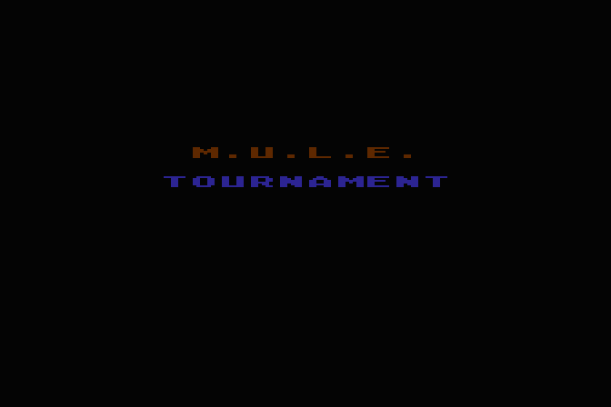

## Contents

1. [Welcome to Planet Irata](#welcome-to-planet-irata)
2. [Getting Started](#getting-started)
3. [The Colony Room](#the-colony-room)
4. [Meet the Colonists](#meet-the-colonists)
5. [The Land](#the-land)
6. [A Month on Irata](#a-month-on-irata)
7. [The Auctions](#the-auctions)
8. [Fortunes and Misfortunes](#fortunes-and-misfortunes)
9. [Catastrophes](#catastrophes)
10. [The Economics of M.U.L.E.](#the-economics-of-mule)
11. [Winning](#winning)
12. [Tips from the Old Hands](#tips-from-the-old-hands)
13. [Reference Chart](#reference-chart)

## Welcome to Planet Irata

**M.U.L.E.** is a game of exploration and economic development. Up to four players try to settle a distant planet with the help of the M.U.L.E., a mule-like machine they will all learn to hate.

The colony ship has dropped you on Irata with a little money, a little food and a lot of hope. Over twelve months you will claim land, buy M.U.L.E.s, fit them out to farm, make energy or mine, and trade what they produce. You are competing with the other colonists to be the richest. But you are also stuck with them: if the colony fails, everybody loses.

This edition of M.U.L.E. is played over the Internet with **FujiNet**. Your Atari plays the game on its own screen while a server keeps everyone's colony in step. The other three colonists can be playing on an Atari, an Apple, a CoCo, a PC, an Adam, an MSX, a Lynx, an Intellivision, an Astrocade or a 2600. Any seat that no person takes is played by the computer, so there is always a full colony of four.

### What You Will Need

- An Atari 400 or 800 with 48K, or any XL or XE computer
- A FujiNet for the Atari, plugged into the SIO port
- A joystick in port 1 (or use the keyboard)

### About This Guide

The rules are those of the **Tournament Game**, the most complete version of the 1983 original: land auctions, M.U.L.E. manufacturing, Crystite and collusion are all in. The pictures in this guide were taken from the Atari 8-bit edition, so what you see here is what you'll see on your screen.

If you have never played, read **Getting Started** and **A Month on Irata**, then jump in. The computer players are patient teachers, and nothing teaches M.U.L.E. like losing to a Mechtron.

## Getting Started

### Loading the Game

M.U.L.E. lives on the Internet, on the TNFS server *irata.online*, so there is nothing to copy. There are two ways to start it.

#### 1. From the FujiNet Lobby

Open the **FujiNet Lobby**, the menu FujiNet uses to list its network games. Pick **M.U.L.E.** and the room **Planet IRATA**. The Lobby gives the game your name and the room, loads it, and starts it. You land straight in the room.

#### 2. By Mounting It Yourself

If M.U.L.E. isn't in your Lobby yet, use FujiNet's configuration screen to add the host *irata.online*, then open the folder for your machine and mount the file below.

|  |  |
|---|---|
| Host | **irata.online** |
| Folder | /mule/atari/ |
| File | **mule.atr** |
| Full address | tnfs://irata.online/mule/atari/mule.atr |

1. Mount *mule.atr* in drive slot 1 and boot. No BASIC or DOS is needed; the disk starts itself.
2. The game loads a part at a time as each phase begins, so the FujiNet disk light flickers now and then. That is normal.

### The First Screens

The title screen says **CONNECTING...** while the game finds your FujiNet. If it says **NO FUJINET FOUND**, check that the FujiNet is connected and switched on, then start again.

If you came from the Lobby, the game already knows your name and the room, and it joins at once. Otherwise it asks **YOUR NAME?** Type it (up to 8 letters) and finish with RETURN. Then pick a room from the **CHOOSE A TABLE** list. FujiNet remembers the room you choose, so next time you start the game it takes you straight back.

### Notes for the Atari

- This is the machine M.U.L.E. was written for, and this edition draws and sounds just like the 1983 original.
- The Atari edition talks to the server over a FujiNet network stream. You don't need to set anything up for it.

### Controls

Everything in M.U.L.E. is done with a direction and one button, which this guide calls *the button*. On the Atari they are:

| Control | What it does |
|---|---|
| Joystick, or CTRL + arrow keys | Walk; move up and down in auctions; left and right in the lobby |
| Trigger or SPACE | The button |
| RETURN | End your development turn |
| 0 | Declaring: sit this good out |
| ESC | Leave the table |
| CTRL-S | Sound off and on |

The leave key (ESC) leaves the room at once while you're waiting in the lobby. During a game it asks first: press it again to leave, or anything else to carry on. When you leave a game the computer takes over your seat, so the others can finish.

## The Colony Room

Games are played in **rooms**. Each room seats four colonists and runs one game at a time.

> Right now there is **one room, Planet IRATA**, open to everyone. More rooms will be added. When they arrive they will show up in the Lobby and in the CHOOSE A TABLE list, and everything in this guide applies to them too.

### Waiting in the Lobby

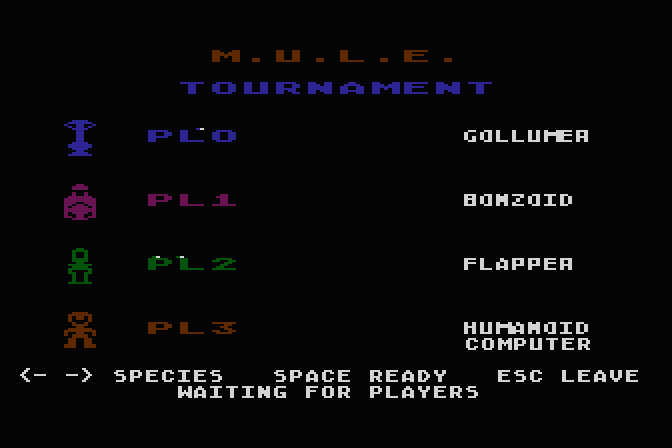

*The room's four seats, with each colonist's name and species.*

When you join a room you take the first free seat and see the room's lobby, with the four seats in their colours. Use the joystick (or CTRL and the arrow keys) left and right to choose your species (see **Meet the Colonists**), and press the trigger (or SPACE) when you're ready.

- The game starts **31 seconds** after the last person joins. Each new arrival starts the count again.
- If every person in the room is ready, it starts after **6 seconds** instead.
- Every empty seat is played by the **computer**: a Mechtron who starts with $1200.

### Joining Late, Leaving Early

- If you join a room whose game has already started, you become a **spectator**. SPECTATOR appears on the screen, and you can watch the game but not play. When it ends, the room goes back to its lobby and you can take a seat.
- If you leave in the middle of a game, the computer plays your seat for the rest of it. That also happens if your machine goes quiet for two minutes. Come back and the seat is yours again.
- A minute after a game ends, the room goes back to the lobby for the next game.

## Meet the Colonists

Eight species signed up for the trip to Irata. Choose one in the lobby. Every species plays by the same rules. Production, prices and luck treat them all alike. What differs is how much money you start with, and how quickly your time runs out on your development turn.

 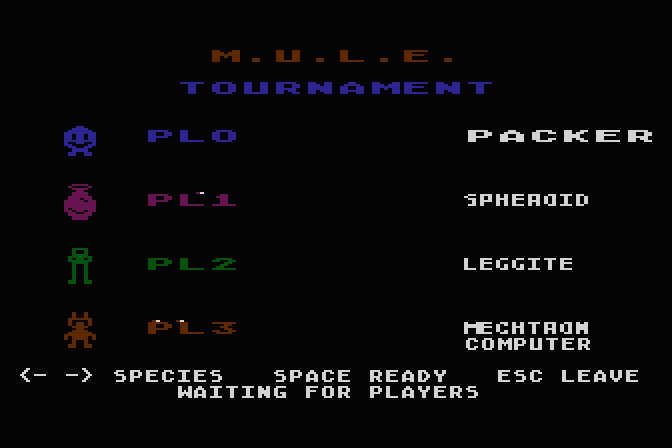

*All eight species: the four the lobby offers first, and the other four.*

| Species | Money | Full turn |
|---|---|---|
| **Mechtron** | $1,000 | about 47 seconds |
| **Gollumer** | $1,000 | about 47 seconds |
| **Packer** | $1,000 | about 47 seconds |
| **Bonzoid** | $1,000 | about 47 seconds |
| **Spheroid** | $1,000 | about 47 seconds |
| **Flapper** | $1,600 | about 61 seconds |
| **Leggite** | $1,000 | about 47 seconds |
| **Humanoid** | $600 | about 34 seconds |
| *Computer (Mechtron)* | $1,200 | about 47 seconds |

### Strengths and Weaknesses

- **The Flapper** is the beginner's colonist. It starts with **$1600**, the most of anyone, and its development turns run about **30% longer** (a full turn lasts about a minute). Good for learning the town, but the money is no excuse for wasting it.
- **The Humanoid** is the expert's colonist. It starts with just **$600** and its turns are about **30% shorter** (a full turn is about half a minute). Choose it to give the others a head start, and to show off.
- **The Mechtron, Gollumer, Packer, Bonzoid, Spheroid and Leggite** are the standard colonists. They start with **$1000** and get a standard turn of about 47 seconds. Which of the six you choose is up to you. They play the same, so choose for looks, or out of spite.
- **The computer** always plays a Mechtron, with **$1200**. It never makes a mistake installing a M.U.L.E. and never has an off day. It also has no imagination, and it can't catch a Wampus.

Everyone starts with **4 units of Food and 2 of Energy**. Your colour is your seat's colour, and it marks your land, your M.U.L.E.s and your line in the auctions.

## The Land

The colony is a map of **45 plots**: five rows of nine. The **town**, with its store, sits in the very middle. The **river** runs down the middle column. **Mountains** are scattered on either side, one, two or three peaks to a plot. Everything else is open **plains**. Hidden underground, there are deposits of **Crystite**.

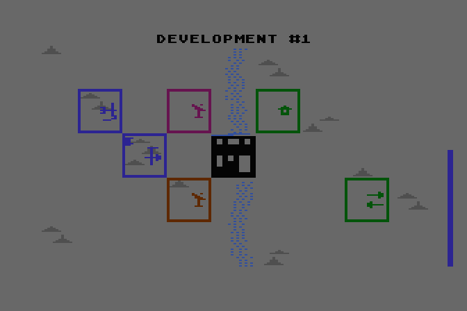

*The town in the middle, the river through it, mountains and plains on either side. A coloured frame shows who owns a plot. The figure inside shows what it makes.*

### What Grows Where

A M.U.L.E. on a plot produces one of four goods. How much it makes depends on the ground. The numbers below are the average monthly output of one M.U.L.E., before any bonuses or luck.

|  | Land | Food | Energy | Smithore | Crystite |
|---|---|---|---|---|---|
|  | **Plains** | 2 | 3 | 1 | by deposit |
|  | **River** | 4 | 2 | – | – |
|  | **Mountains (one)** | 1 | 1 | 2 | by deposit |
|  | **Mountains (two)** | 1 | 1 | 3 | by deposit |
|  | **Mountains (three)** | 1 | 1 | 4 | by deposit |
| 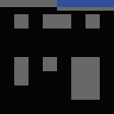 | **Town** | – | – | – | – |

- **Food** grows best by the river (4), fair on the plains (2), poorly in the mountains (1).
- **Energy** is best on the plains (3), fair on the river (2), poor in the mountains (1).
- **Smithore** is mined in the mountains: 2, 3 or 4 a month for one, two or three peaks. The plains yield only 1. It can't be mined on the river.
- **Crystite** depends only on what's underground (see below), on plains or mountains alike. It can't be mined on the river.

### The Four Goods

|  | M.U.L.E. | Outfit | Opening price |
|---|---|---|---|
| 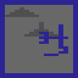 | **Food** | $25 | $30 |
|  | **Energy** | $50 | $25 |
|  | **Smithore** | $75 | $50 |
|  | **Crystite** | $100 | $100 |

- **Food** decides how long your turns are. Without enough of it you'll have only a few seconds to work in. Half of any Food left over at the end of a month spoils.
- **Energy** powers your M.U.L.E.s: every M.U.L.E. that isn't making Energy uses 1 unit a month. For each unit you're short, one of your plots makes nothing. A quarter of any leftover Energy spoils.
- **Smithore** is what the store builds M.U.L.E.s from, two bars to a M.U.L.E. It doesn't spoil, but you can't keep more than 50.
- **Crystite** is a precious mineral that is only worth money: the store buys it after each month's Crystite auction at a price that jumps around wildly. You can't keep more than 50 of it either.

### Crystite

Crystite deposits are invisible until you look for them. There are four rich spots on the map. Each is **High** at its centre, **Medium** on the plots beside it, and **Low** one plot farther out. A plot's deposit (0 for none, up to 3) is how much a Crystite M.U.L.E. makes there. A meteorite can create a **Very High** deposit worth 4.

To find Crystite, take a sample. Go to a plot during your turn and press the trigger (or SPACE) when you aren't leading a M.U.L.E. and aren't next to the Wampus. Then carry the sample to the **Assay Office** in town, which tells you what's there.

### Bonuses

- **Economies of scale.** For every three plots you own that make the same good, each of them makes 1 more.
- **The learning curve.** A plot makes 1 more if you own a plot right beside it (above, below, left or right) that makes the same good.
- **Luck.** Each month's output wobbles around these numbers, and no plot ever makes more than 8.

## A Month on Irata

The game lasts **twelve months**, or rounds. Every month goes through the same phases in the same order, and the screen tells you which one you're in. Here they are, in order.

#### 1. The Summary Report

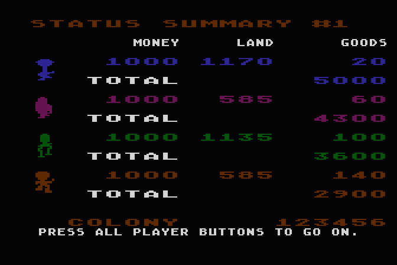

**Before each month starts, the Status Summary shows where everybody stands.**

Each colonist's **money**, **land** and **goods** are added up into a total. The colony's total is shown at the bottom. Players are listed best first. When you have read it, press the trigger (or SPACE). The game goes on when everybody has.

#### 2. The Transport Ship

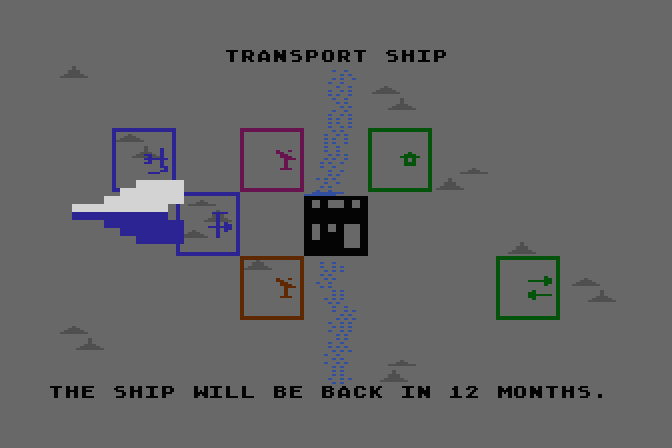

**In the first month the colony ship lands and drops you off.**

Enjoy the view. After the twelfth month it comes back to take a look at what you've done.

#### 3. Land Grant

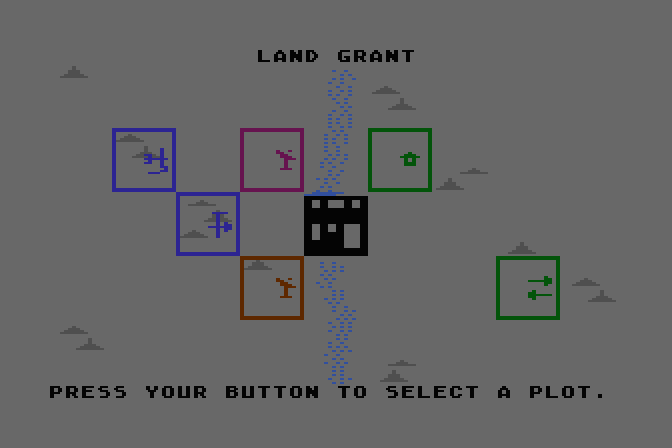

**Every month each colonist gets one free plot.**

A square moves across the map, a plot at a time, skipping the town and land that's already taken. When it's over the plot you want, press the trigger (or SPACE). The plot is outlined in your colour. You get one claim per month, and the square won't wait for you. If two players press for the same plot, the one who is further behind gets it.

#### 4. Land Auction

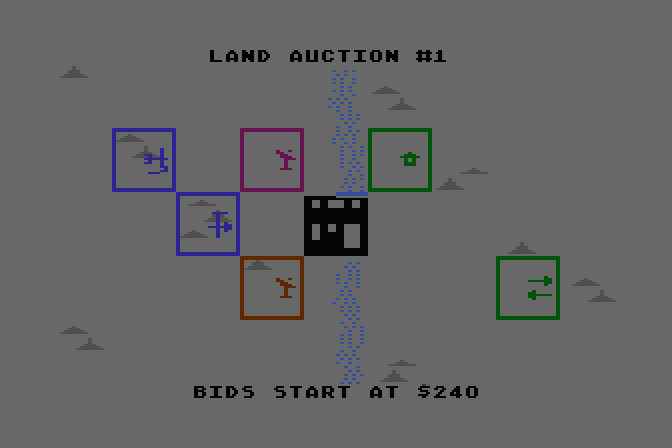

**Some months, extra land is auctioned.**

First any plots that players have put up for sale are auctioned, then sometimes a plot or two from the colony. The plot for sale flashes on the map. Press the trigger (or SPACE) to get on with it.

#### 5. Bidding

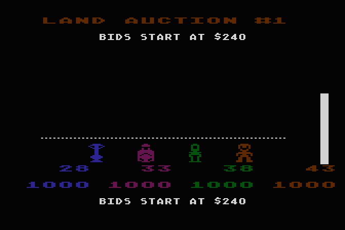

**Push up to bid. The higher you stand, the more you offer.**

Every colonist stands at the bottom of the screen. Hold the joystick (or CTRL and the arrow keys) up to walk up the price scale, $4 a step. Let go and you drift back down. The colony's plot goes to the highest bid at or above the starting price when time runs out. A plot a player is selling goes as soon as a bid reaches the seller's price. You can't bid more than you have.

#### 6. Development

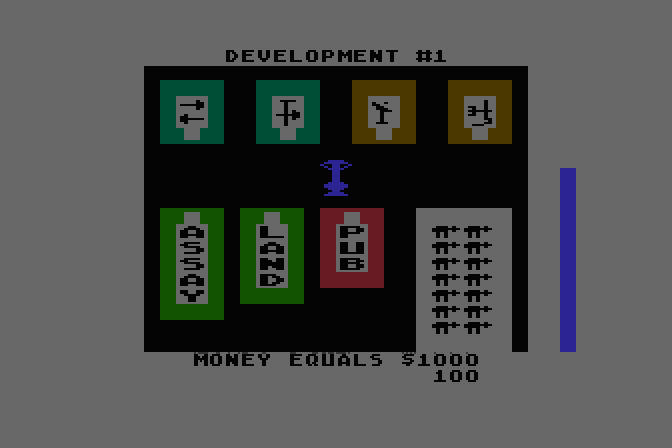

**Now it's your turn to work. Press the trigger (or SPACE) to start.**

The time bar shows how long you have. A full turn needs this month's **Food**: 3 units in months 1–3, 4 in months 4–7, and 5 after that. With less food your turn is shorter, and with none it's over almost before it starts. Turns go best player first, unless the store is low on M.U.L.E.s, in which case they go in reverse. When you are finished, press RETURN to end your turn early.

#### 7. In Town

**Walk into the buildings to do business.**

The town is the store. Walk into the **corral** to buy a M.U.L.E. at the price shown. It follows you around. Lead it into one of the four **outfitters** to fit it out for **Food** ($25), **Energy** ($50), **Smithore** ($75) or **Crystite** ($100). The **Assay Office** analyses a Crystite sample. Visit the **Land Office**, then press the trigger (or SPACE) on one of your plots to put it up for sale at the next land auction. The **Pub** pays you a little gambling money and ends your turn. Changed your mind? Walk the M.U.L.E. back into the corral and you get its price back, though not the outfit.

#### 8. Installing Your M.U.L.E.

**Walk out of town to your land and press the trigger (or SPACE) to install your M.U.L.E.**

Your M.U.L.E. is installed when you press the trigger (or SPACE) on a plot you own. The plot then shows what it makes. Installing it on a plot that isn't yours, or with no outfit, makes it run away. If your time runs out while you're leading it, it runs away too. Smithore and Crystite M.U.L.E.s can't work on the river, and nothing goes in town. Press the trigger (or SPACE) on a plot that already has a M.U.L.E. and you swap: the new one goes in, and you're leading the old one. Walking is quickest on the plains, slower across the river and slowest over the mountains.

#### 9. Wampus Hunting

**Something flashes in the mountains.**

That's the **Wampus**. It shows up now and then, hides, and moves on. Walk up to it while it's showing, without a M.U.L.E. in tow, and press the trigger (or SPACE) to catch it. The reward is $100 in months 1–3, $200 in months 4–7, $300 in months 8–11 and $400 in month 12. You can catch it only once a turn.

#### 10. The Pub

**Going into the Pub ends your turn, and pays.**

You win $50 (months 1–3), $100 (4–7), $150 (8–11) or $200 (12), plus a random bonus that grows with the time you had left, up to $250 in all. Leftover time is worth something here, and nowhere else.

#### 11. Random Events

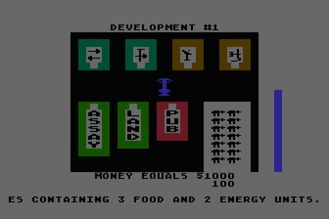

**Sometimes good or bad luck strikes at the start of your turn.**

About one turn in four starts with a message about something that just happened to you: a prize, a gift, a bill, a theft. See **Fortunes and Misfortunes** for the full list. Luck isn't quite blind: the leader never gets good news, and the two players at the bottom never get bad news.

#### 12. Production

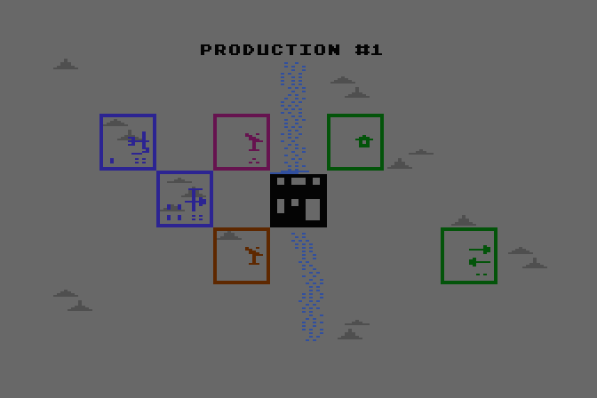

**When everyone has had a turn, the M.U.L.E.s get to work.**

Each plot with a M.U.L.E. shows how many units it made. First, though, the colony's Food is eaten, its Energy used, and some of what's left spoils.

#### 13. The Colony Event

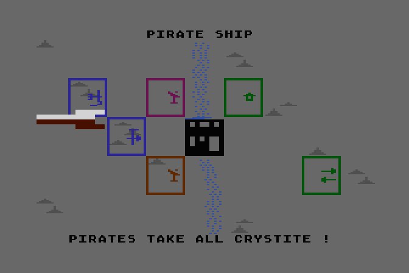

**Most months, something happens to the whole colony.**

Pests, pirates, acid rain, planetquakes and more. See **Catastrophes**. In the last month the ship returns instead.

## The Auctions

After production comes trading. Each good is auctioned in turn: **Smithore** first, then **Crystite**, **Food** and **Energy**. A good nobody has is skipped.

#### 14. Player Status

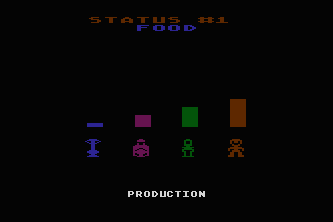

**First you see how much of the good each player has.**

Bars show each colonist's amount: what they had, what they used, what spoiled and what they produced. The line across the bars is your **critical level**, what you'll need next month: next month's Food, or the Energy your M.U.L.E.s will use. Above it you have a surplus to sell. Below it you're short.

#### 15. Declaring

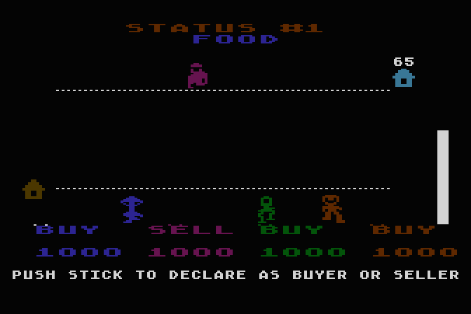

**Decide whether you're a Buyer or a Seller.**

While the timer counts down, push the joystick (or CTRL and the arrow keys) up to be a **Seller** or down to be a **Buyer**. Press 0 to sit this good out. If you do nothing, you'll be a Seller if you have more than your critical level and a Buyer if you don't.

#### 16. Trading

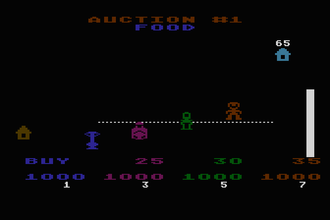

**Sellers start at the top, Buyers at the bottom. Walk towards each other.**

Hold the joystick (or CTRL and the arrow keys) to move. A Seller walks down to lower the asking price, and a Buyer walks up to raise the bid. The dashed lines show the lowest ask and the highest bid. When a Buyer and a Seller meet, goods change hands, slowly at first and then faster, and the auction clock stops while they trade. The **store** is always there too. It sells at the top of the screen while it has stock, and buys at the bottom. You can't buy for more than the store asks, or sell for less than it pays. Ties go to the player who is further behind.

### The Critical Level

When you sell Food or Energy, you can't sell below your critical level. The game stops you with **SELLER AT CRITICAL LEVEL!** so you don't starve yourself out of next month's turn. Smithore and Crystite have no critical level. Sell them all if you like.

### Collusion

Two or more players can make a private deal. If they press the trigger (or SPACE) at nearly the same moment during trading, they **collude**: for a short while they trade only with each other, and the store is shut out. It's a fine way to help a friend or squeeze a rival.

### The Corral

At the end of each month the store turns Smithore into M.U.L.E.s, two bars each, up to a corral of 14. The price of a M.U.L.E. follows the price of Smithore. If nobody sells the store Smithore, there are no new M.U.L.E.s, and the ones left get expensive. Then the month ends with another Summary Report.

## Fortunes and Misfortunes

At the start of each development turn there is a little better than a one-in-four chance of a personal event. Each one can happen only **once per game**, to anybody. The amounts grow as the colony does: the base amount is **$25** in months 1–3, **$50** in 4–7, **$75** in 8–11 and **$100** in month 12.

- The player in **first place** never gets good fortune.
- The players in **third and fourth place** never get misfortune.
- A player who has run out of Food and isn't in first place gets the food parcel from home, if it hasn't already been used.
- Money never drops below zero.

### Good Fortune

| The message | What it does |
|---|---|
| *“You just received a package from your home-world relatives containing 3 food and 2 energy units.”* | +3 Food, +2 Energy |
| *“A wandering space traveler repaid your hospitality by leaving two bars of smithore.”* | +2 Smithore |
| *“Your M.U.L.E. Was judged "best built" at the colony fair. You won $….”* | +$50 / $100 / $150 / $200 (you own a m.u.l.e.) |
| *“Your M.U.L.E. Won the colony tap-dancing contest. You collected $….”* | +$100 / $200 / $300 / $400 (you own a m.u.l.e.) |
| *“The colony council for agriculture awarded you $… for each food plot you have developed. The total grant is $….”* | +$50 / $100 / $150 / $200 for each Food plot (you have a food m.u.l.e.) |
| *“The colony awarded you $… for stopping the wart worm infestation.”* | +$100 / $200 / $300 / $400 |
| *“The museum bought your antique personal computer for $….”* | +$200 / $400 / $600 / $800 |
| *“You won the colony swamp eel eating contest and collected $…. (Yecch!)”* | +$50 / $100 / $150 / $200 |
| *“A charity from your home-world took pity on you and sent $….”* | +$75 / $150 / $225 / $300 |
| *“Your offworld investments in artificial dumbness paid $… in dividends.”* | +$150 / $300 / $450 / $600 |
| *“A distant relative died and left you a vast fortune. But after taxes you only got $….”* | +$100 / $200 / $300 / $400 |
| *“You found a dead moose rat and sold the hide for $….”* | +$50 / $100 / $150 / $200 |
| *“You received an extra plot of land to encourage colony development.”* | A free plot, chosen at random |

### Misfortune

| The message | What it does |
|---|---|
| *“Mischievous glac-elves broke into your storage shed and stole half your food.”* | Lose half your Food |
| *“One of your M.U.L.E.S lost a bolt. Repairs cost you $….”* | −$75 / $150 / $225 / $300 (you own a m.u.l.e.) |
| *“Your mining M.U.L.E.S have deteriorated from heavy use and must be repaired. The cost is $….”* | −$50 / $100 / $150 / $200 for each Smithore or Crystite M.U.L.E. |
| *“The solar collectors on your energy M.U.L.E.S are dirty. Cleaning cost you $….”* | −$25 / $50 / $75 / $100 for each Energy M.U.L.E. |
| *“Your space gypsy in-laws made a mess of the town. It cost you $… to clean it up.”* | −$150 / $300 / $450 / $600 |
| *“Flying cat-bugs ate the roof off your house. Repairs cost $….”* | −$100 / $200 / $300 / $400 |
| *“You lost $… betting on the two-legged kazinga races.”* | −$100 / $200 / $300 / $400 |
| *“Your child was bitten by a bat lizard and the hospital bill cost you $….”* | −$100 / $200 / $300 / $400 |
| *“You lost a plot of land because the claim was not recorded.”* | Lose the plot you got most recently, and any M.U.L.E. on it |

## Catastrophes

Every month, after the M.U.L.E.s have done their work and before the goods are counted, the colony may be hit by an event that affects everybody, or the leaders in particular. Each kind of event can happen only so many times in a game. The more of a kind are left, the likelier it is. If the event drawn has nothing to hit (no Food plots for the pests, say), the colony gets a quiet month.

#### Pest Attack

*Can happen up to 3 times a game.*

> “Pests have attacked a food plot and ruined its entire crop.”

One Food plot belonging to the first- or second-place player produces nothing this month.

#### Space Pirates

*Can happen up to 2 times a game.*

> “Space pirates have raided the colony and stolen all the crystite.”

Every player loses all their Crystite, including this month's production.

#### Acid Rain Storm

*Can happen up to 3 times a game.*

> “An acid rain storm has increased food production and decreased energy production.”

In one row of the map Food plots make 4 more and Energy plots 2 less. Everywhere else, Food makes 1 more and Energy 1 less.

#### Planetquake

*Can happen up to 3 times a game.*

> “A planetquake has reduced mining production by half.”

Smithore and Crystite production is cut in half. Half the time a mountain also slides sideways onto the plains next to it, destroying any M.U.L.E. on either plot.

#### Sunspot Activity

*Can happen up to 3 times a game.*

> “Sunspot activity has increased energy production.”

Every Energy plot makes 3 more (up to the limit of 8).

#### Meteorite

*Can happen up to 2 times a game.*

> “A meteorite has struck the colony, creating a huge crystite deposit.”

A plot (not river or town) becomes a Very High crystite deposit. Any M.U.L.E. on it is destroyed.

#### Cosmic Radiation

*Can happen up to 2 times a game.*

> “Radiation from a cosmic storm has destroyed a M.U.L.E.”

One M.U.L.E. belonging to the first- or second-place player is destroyed.

#### Fire in the Store

*Can happen up to 2 times a game.*

> “A fire in the store has destroyed all food, energy and smithore.”

The store's Food, Energy and Smithore are gone. Players' own goods are safe.

In the **twelfth month** there is no catastrophe. Instead: *the ship is returning. the colony's twelve months are up!*

## The Economics of M.U.L.E.

### Supply and Demand

The store sets a **reference price** for each good before its auction. Food and Energy prices rise when the colony has less than it needs and fall when there's plenty. Smithore follows the demand for M.U.L.E.s: empty plots waiting for them push it up, and a full corral and a well-stocked store pull it down. Crystite prices are pure chance, anywhere from $50 to $149 before each auction. After an auction, the price becomes the average price people actually traded at.

In the table, P is the store's reference price for the good.

| Good | Store buys at | Store sells at |
|---|---|---|
| **Food** | P − $15 | P + $20 |
| **Energy** | P − $15 | P + $20 |
| **Smithore** | P | P + $35 |
| **Crystite** | P (rounded down to $4) | that + $140 |

Prices never go below a floor (Food $30, Energy $25, Smithore $20, Crystite $50) or above $250.

### Starting Out

|  |  |
|---|---|
| Each colonist | $1000 (Flapper $1600, Humanoid $600, computer $1200), 4 Food, 2 Energy |
| The store | 8 Food, 8 Energy, 8 Smithore, no Crystite, 14 M.U.L.E.s |
| Opening prices | Food $30, Energy $25, Smithore $50, Crystite $100, M.U.L.E. $100 |

### Land

Land costs nothing in the Land Grant and something at auction. The first land auction of the game starts at $160. After that, each auction starts at $60 less than the last price paid, but never below $60. Each plot you own counts $500 towards your score, whatever you paid.

### Running Out

If the colony ever runs completely out of **Food** or of **Energy** (the store, every player and every M.U.L.E. making it), the colony has **failed** and the game ends at once. Nobody wins. Keep an eye on the store, even when you're winning.

## Winning

After the twelfth month the colony is judged and the game is over.

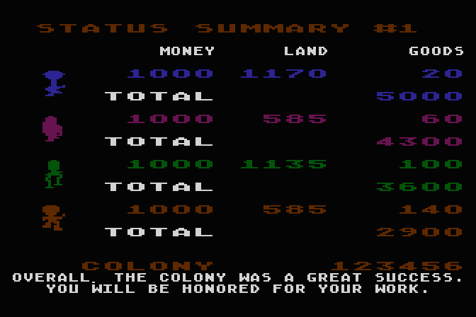

*The colony is rated and the richest colonist is named.*

### Your Score

- **Money**: every dollar you have.
- **Land**: $500 for every plot. A plot with a M.U.L.E. on it also counts the M.U.L.E.'s outfit price plus $35.
- **Goods**: every unit you hold, at the store's price.

The colonist with the highest total wins and is proclaimed the colony's **FIRST FOUNDER**.

### The Colony Rating

Then the federation rates the colony on everybody's totals added together. Winning a failed colony is cold comfort.

|  | Colony total | The verdict |
|---|---|---|
| 0 | under $20,000, or the colony ran out of Food or Energy | *“The colony failed. The federation will not be sending another ship. You will all be left to die.”* |
| 1 | $20,000 | *“The colony failed. The few survivors are taken off-planet by federation police. You have been sentenced to pay reparations.”* |
| 2 | $40,000 | *“The colony barely survived. The federation has decided to keep it running, but with a new set of leaders.”* |
| 3 | $60,000 | *“The colony was a success. The federation is pleased and will send new colonists.”* |
| 4 | $80,000 | *“The colony was a great success. You will be honored for your work.”* |
| 5 | $100,000 | *“The colony was a tremendous success. You will all be named honorary citizens.”* |
| 6 | $120,000 or more | *“The colony was a phenomenal success! The federation is delighted and has declared Irata a planetary landmark.”* |

## Tips from the Old Hands

### Tips on the Tournament Game

- Claim land next to the river for Food and on the mountains for Smithore. Plains are fine for Energy.
- Grow your own Food early. Without it your turns get so short that you can't do anything else.
- Keep a little Energy on hand for every M.U.L.E. you own, or some of them will sit idle.
- Put the same good on plots next to each other, and on three plots or more. The bonuses add up fast.
- Smithore is the colony's bottleneck. When the corral runs low, Smithore prices climb and so do M.U.L.E. prices.
- Assay before you dig. Crystite is a gamble, and a High deposit is a winning ticket.
- Never walk a M.U.L.E. onto someone else's land. It won't come back.
- Leftover time is worth money at the Pub, but only when it's left over.
- The store always sells at the top and buys at the bottom. Beat its prices and the other players will trade with you.
- When a rival is desperate for Food, consider declaring yourself a Seller. Then consider your price.

### Some Questions and Their Answers

**Q: Why didn't I get the plot I wanted in the Land Grant?**  
A: Someone else wanted it too. When two players press for the same plot, the one who is further behind gets it. Or the square had already moved on.

**Q: My M.U.L.E. keeps running away. What can I do?**  
A: Install it only on your own land, give it an outfit first, and leave yourself time to walk it there. If time is short, walk it back to the corral and get your money back.

**Q: Sometimes I walk into the corral and can't get a M.U.L.E. Why not?**  
A: Either the corral is empty, or you don't have enough money. Look at the price over the corral.

**Q: Why can't I sell my last few units of Food?**  
A: You're at your critical level. The game is keeping enough for your next turn.

**Q: Why can't I catch the Wampus?**  
A: You may be leading a M.U.L.E. (Wampuses don't like them), it may be hiding, or you may already have caught it this turn.

**Q: Can I play with a friend on another kind of computer?**  
A: Yes. Every edition of the game plays in the same rooms. Just pick the same room.

**Q: What happens if my connection drops?**  
A: The computer looks after your seat until you come back. Start the game again and it rejoins your room.

**Q: Where do the extra rooms go?**  
A: There is one room, Planet IRATA, today. More are on the way, and they'll appear in the room list when they open.

## Reference Chart

### Production per M.U.L.E. (average, before bonuses)

| Land | Food | Energy | Smithore | Crystite |
|---|---|---|---|---|
| Plains | 2 | 3 | 1 | deposit (0–4) |
| River | 4 | 2 | – | – |
| Mountains (one) | 1 | 1 | 2 | deposit (0–4) |
| Mountains (two) | 1 | 1 | 3 | deposit (0–4) |
| Mountains (three) | 1 | 1 | 4 | deposit (0–4) |

### The Store

|  | Food | Energy | Smithore | Crystite | M.U.L.E. |
|---|---|---|---|---|---|
| Outfit | $25 | $50 | $75 | $100 | – |
| Opening price | $30 | $25 | $50 | $100 | $100 |
| Opening stock | 8 | 8 | 8 | 0 | 14 |
| Lowest price | $30 | $25 | $20 | $50 | – |

### Month by Month

| Months | 1–3 | 4–7 | 8–11 | 12 |
|---|---|---|---|---|
| Food for a full turn | 3 | 4 | 5 | 5 |
| Event base amount | $25 | $50 | $75 | $100 |
| Wampus reward | $100 | $200 | $300 | $400 |
| Pub base winnings | $50 | $100 | $150 | $200 |

### Limits

- A plot makes at most 8 units a month.
- Half of leftover Food and a quarter of leftover Energy spoil each month.
- You can hold at most 50 Smithore and 50 Crystite.
- The corral holds up to 14 M.U.L.E.s; each new one uses 2 Smithore.
- Each plot counts $500 towards your score; a M.U.L.E. on it adds its outfit cost plus $35.

---

*M.U.L.E. was designed by Ozark Softscape and published by Electronic Arts in 1983. The FujiNet Multiplayer Edition is a network version made by the FujiNet community; its pictures are converted from the 1983 Atari disk and remain the property of their owners.*

*Other editions of this guide: [[M.U.L.E. Player's Guide|MULE-Players-Guide]]*
